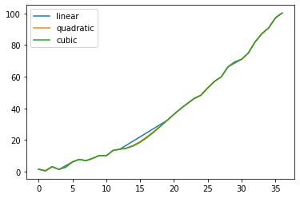

# 第6章 缺失数据

> 学习感受：之前主要是是使用dropna和fillna，对于类型和运算没有关注过，之前对插值也没怎么接触，值得仔细的学习一下

#### 在接下来的两章中，会接触到数据预处理中比较麻烦的类型，即缺失数据和文本数据（尤其是混杂型文本）
#### Pandas在步入1.0后，对数据类型也做出了新的尝试，尤其是Nullable类型和String类型，了解这些可能在未来成为主流的新特性是必要的


```python
import pandas as pd
import numpy as np
df = pd.read_csv('data/table_missing.csv')
df.head()
```


<div>
<style scoped>
    .dataframe tbody tr th:only-of-type {
        vertical-align: middle;
    }

    .dataframe tbody tr th {
        vertical-align: top;
    }

    .dataframe thead th {
        text-align: right;
    }
</style>
<table border="1" class="dataframe">
  <thead>
    <tr style="text-align: right;">
      <th></th>
      <th>School</th>
      <th>Class</th>
      <th>ID</th>
      <th>Gender</th>
      <th>Address</th>
      <th>Height</th>
      <th>Weight</th>
      <th>Math</th>
      <th>Physics</th>
    </tr>
  </thead>
  <tbody>
    <tr>
      <th>0</th>
      <td>S_1</td>
      <td>C_1</td>
      <td>NaN</td>
      <td>M</td>
      <td>street_1</td>
      <td>173</td>
      <td>NaN</td>
      <td>34.0</td>
      <td>A+</td>
    </tr>
    <tr>
      <th>1</th>
      <td>S_1</td>
      <td>C_1</td>
      <td>NaN</td>
      <td>F</td>
      <td>street_2</td>
      <td>192</td>
      <td>NaN</td>
      <td>32.5</td>
      <td>B+</td>
    </tr>
    <tr>
      <th>2</th>
      <td>S_1</td>
      <td>C_1</td>
      <td>1103.0</td>
      <td>M</td>
      <td>street_2</td>
      <td>186</td>
      <td>NaN</td>
      <td>87.2</td>
      <td>B+</td>
    </tr>
    <tr>
      <th>3</th>
      <td>S_1</td>
      <td>NaN</td>
      <td>NaN</td>
      <td>F</td>
      <td>street_2</td>
      <td>167</td>
      <td>81.0</td>
      <td>80.4</td>
      <td>NaN</td>
    </tr>
    <tr>
      <th>4</th>
      <td>S_1</td>
      <td>C_1</td>
      <td>1105.0</td>
      <td>NaN</td>
      <td>street_4</td>
      <td>159</td>
      <td>64.0</td>
      <td>84.8</td>
      <td>A-</td>
    </tr>
  </tbody>
</table>
</div>


## 一、缺失观测及其类型

### 1. 了解缺失信息
#### （a）isna和notna方法
#### 对Series使用会返回布尔列表


```python
df['Physics'].isna().head()
```


    0    False
    1    False
    2    False
    3     True
    4    False
    Name: Physics, dtype: bool


```python
df['Physics'].notna().head()
```


    0     True
    1     True
    2     True
    3    False
    4     True
    Name: Physics, dtype: bool


#### 对DataFrame使用会返回布尔表


```python
df.isna().head()
```


<div>
<style scoped>
    .dataframe tbody tr th:only-of-type {
        vertical-align: middle;
    }

    .dataframe tbody tr th {
        vertical-align: top;
    }

    .dataframe thead th {
        text-align: right;
    }
</style>
<table border="1" class="dataframe">
  <thead>
    <tr style="text-align: right;">
      <th></th>
      <th>School</th>
      <th>Class</th>
      <th>ID</th>
      <th>Gender</th>
      <th>Address</th>
      <th>Height</th>
      <th>Weight</th>
      <th>Math</th>
      <th>Physics</th>
    </tr>
  </thead>
  <tbody>
    <tr>
      <th>0</th>
      <td>False</td>
      <td>False</td>
      <td>True</td>
      <td>False</td>
      <td>False</td>
      <td>False</td>
      <td>True</td>
      <td>False</td>
      <td>False</td>
    </tr>
    <tr>
      <th>1</th>
      <td>False</td>
      <td>False</td>
      <td>True</td>
      <td>False</td>
      <td>False</td>
      <td>False</td>
      <td>True</td>
      <td>False</td>
      <td>False</td>
    </tr>
    <tr>
      <th>2</th>
      <td>False</td>
      <td>False</td>
      <td>False</td>
      <td>False</td>
      <td>False</td>
      <td>False</td>
      <td>True</td>
      <td>False</td>
      <td>False</td>
    </tr>
    <tr>
      <th>3</th>
      <td>False</td>
      <td>True</td>
      <td>True</td>
      <td>False</td>
      <td>False</td>
      <td>False</td>
      <td>False</td>
      <td>False</td>
      <td>True</td>
    </tr>
    <tr>
      <th>4</th>
      <td>False</td>
      <td>False</td>
      <td>False</td>
      <td>True</td>
      <td>False</td>
      <td>False</td>
      <td>False</td>
      <td>False</td>
      <td>False</td>
    </tr>
  </tbody>
</table>
</div>


#### 但对于DataFrame我们更关心到底每列有多少缺失值


```python
df.isna().sum()
```


    School      0
    Class       4
    ID          6
    Gender      7
    Address     0
    Height      0
    Weight     13
    Math        5
    Physics     4
    dtype: int64


#### 此外，可以通过第1章中介绍的info函数查看缺失信息


```python
df.info()
```

    <class 'pandas.core.frame.DataFrame'>
    RangeIndex: 35 entries, 0 to 34
    Data columns (total 9 columns):
     #   Column   Non-Null Count  Dtype  
    ---  ------   --------------  -----  
     0   School   35 non-null     object 
     1   Class    31 non-null     object 
     2   ID       29 non-null     float64
     3   Gender   28 non-null     object 
     4   Address  35 non-null     object 
     5   Height   35 non-null     int64  
     6   Weight   22 non-null     float64
     7   Math     30 non-null     float64
     8   Physics  31 non-null     object 
    dtypes: float64(3), int64(1), object(5)
    memory usage: 2.6+ KB


#### （b）查看缺失值的所以在行

#### 以最后一列为例，挑出该列缺失值的行


```python
df[df['Physics'].isna()]
```


<div>
<style scoped>
    .dataframe tbody tr th:only-of-type {
        vertical-align: middle;
    }

    .dataframe tbody tr th {
        vertical-align: top;
    }

    .dataframe thead th {
        text-align: right;
    }
</style>
<table border="1" class="dataframe">
  <thead>
    <tr style="text-align: right;">
      <th></th>
      <th>School</th>
      <th>Class</th>
      <th>ID</th>
      <th>Gender</th>
      <th>Address</th>
      <th>Height</th>
      <th>Weight</th>
      <th>Math</th>
      <th>Physics</th>
    </tr>
  </thead>
  <tbody>
    <tr>
      <th>3</th>
      <td>S_1</td>
      <td>NaN</td>
      <td>NaN</td>
      <td>F</td>
      <td>street_2</td>
      <td>167</td>
      <td>81.0</td>
      <td>80.4</td>
      <td>NaN</td>
    </tr>
    <tr>
      <th>8</th>
      <td>S_1</td>
      <td>C_2</td>
      <td>1204.0</td>
      <td>F</td>
      <td>street_5</td>
      <td>162</td>
      <td>63.0</td>
      <td>33.8</td>
      <td>NaN</td>
    </tr>
    <tr>
      <th>13</th>
      <td>S_1</td>
      <td>C_3</td>
      <td>1304.0</td>
      <td>NaN</td>
      <td>street_2</td>
      <td>195</td>
      <td>70.0</td>
      <td>85.2</td>
      <td>NaN</td>
    </tr>
    <tr>
      <th>22</th>
      <td>S_2</td>
      <td>C_2</td>
      <td>2203.0</td>
      <td>M</td>
      <td>street_4</td>
      <td>155</td>
      <td>91.0</td>
      <td>73.8</td>
      <td>NaN</td>
    </tr>
  </tbody>
</table>
</div>


#### （c）挑选出所有非缺失值列
#### 使用all就是全部非缺失值，如果是any就是至少有一个不是缺失值


```python
df[df.notna().all(1)]
```


<div>
<style scoped>
    .dataframe tbody tr th:only-of-type {
        vertical-align: middle;
    }

    .dataframe tbody tr th {
        vertical-align: top;
    }

    .dataframe thead th {
        text-align: right;
    }
</style>
<table border="1" class="dataframe">
  <thead>
    <tr style="text-align: right;">
      <th></th>
      <th>School</th>
      <th>Class</th>
      <th>ID</th>
      <th>Gender</th>
      <th>Address</th>
      <th>Height</th>
      <th>Weight</th>
      <th>Math</th>
      <th>Physics</th>
    </tr>
  </thead>
  <tbody>
    <tr>
      <th>5</th>
      <td>S_1</td>
      <td>C_2</td>
      <td>1201.0</td>
      <td>M</td>
      <td>street_5</td>
      <td>159</td>
      <td>68.0</td>
      <td>97.0</td>
      <td>A-</td>
    </tr>
    <tr>
      <th>6</th>
      <td>S_1</td>
      <td>C_2</td>
      <td>1202.0</td>
      <td>F</td>
      <td>street_4</td>
      <td>176</td>
      <td>94.0</td>
      <td>63.5</td>
      <td>B-</td>
    </tr>
    <tr>
      <th>12</th>
      <td>S_1</td>
      <td>C_3</td>
      <td>1303.0</td>
      <td>M</td>
      <td>street_7</td>
      <td>188</td>
      <td>82.0</td>
      <td>49.7</td>
      <td>B</td>
    </tr>
    <tr>
      <th>17</th>
      <td>S_2</td>
      <td>C_1</td>
      <td>2103.0</td>
      <td>M</td>
      <td>street_4</td>
      <td>157</td>
      <td>61.0</td>
      <td>52.5</td>
      <td>B-</td>
    </tr>
    <tr>
      <th>21</th>
      <td>S_2</td>
      <td>C_2</td>
      <td>2202.0</td>
      <td>F</td>
      <td>street_7</td>
      <td>194</td>
      <td>77.0</td>
      <td>68.5</td>
      <td>B+</td>
    </tr>
    <tr>
      <th>25</th>
      <td>S_2</td>
      <td>C_3</td>
      <td>2301.0</td>
      <td>F</td>
      <td>street_4</td>
      <td>157</td>
      <td>78.0</td>
      <td>72.3</td>
      <td>B+</td>
    </tr>
    <tr>
      <th>27</th>
      <td>S_2</td>
      <td>C_3</td>
      <td>2303.0</td>
      <td>F</td>
      <td>street_7</td>
      <td>190</td>
      <td>99.0</td>
      <td>65.9</td>
      <td>C</td>
    </tr>
    <tr>
      <th>28</th>
      <td>S_2</td>
      <td>C_3</td>
      <td>2304.0</td>
      <td>F</td>
      <td>street_6</td>
      <td>164</td>
      <td>81.0</td>
      <td>95.5</td>
      <td>A-</td>
    </tr>
    <tr>
      <th>29</th>
      <td>S_2</td>
      <td>C_3</td>
      <td>2305.0</td>
      <td>M</td>
      <td>street_4</td>
      <td>187</td>
      <td>73.0</td>
      <td>48.9</td>
      <td>B</td>
    </tr>
  </tbody>
</table>
</div>


### 2. 三种缺失符号
#### （a）np.nan
#### np.nan是一个麻烦的东西，首先它不等与任何东西，甚至不等于自己


```python
np.nan == np.nan
```


    False


```python
np.nan == 0
```


    False


```python
np.nan == None
```


    False


#### 在用equals函数比较时，自动略过两侧全是np.nan的单元格，因此结果不会影响


```python
df.equals(df)
```


    True


#### 其次，它在numpy中的类型为浮点，由此导致数据集读入时，即使原来是整数的列，只要有缺失值就会变为浮点型


```python
type(np.nan)
```


    float


```python
pd.Series([1,2,3]).dtype
```


    dtype('int64')


```python
pd.Series([1,np.nan,3]).dtype
```


    dtype('float64')


#### 此外，对于布尔类型的列表，如果是np.nan填充，那么它的值会自动变为True而不是False


```python
pd.Series([1,np.nan,3],dtype='bool')
```


    0    True
    1    True
    2    True
    dtype: bool


#### 但当修改一个布尔列表时，会改变列表类型，而不是赋值为True


```python
s = pd.Series([True,False],dtype='bool')
s[1]=np.nan
s
```


    0    1.0
    1    NaN
    dtype: float64


#### 在所有的表格读取后，无论列是存放什么类型的数据，默认的缺失值全为np.nan类型
#### 因此整型列转为浮点；而字符由于无法转化为浮点，因此只能归并为object类型（'O'），原来是浮点型的则类型不变


```python
df['ID'].dtype
```


    dtype('float64')


```python
df['Math'].dtype
```


    dtype('float64')


```python
df['Class'].dtype
```


    dtype('O')


#### （b）None
#### None比前者稍微好些，至少它会等于自身


```python
None == None
```


    True


#### 它的布尔值为False


```python
pd.Series([None],dtype='bool')
```


    0    False
    dtype: bool


#### 修改布尔列表不会改变数据类型


```python
s = pd.Series([True,False],dtype='bool')
s[0]=None
s
```


    0    False
    1    False
    dtype: bool


```python
s = pd.Series([1,0],dtype='bool')
s[0]=None
s
```


    0    False
    1    False
    dtype: bool


#### 在传入数值类型后，会自动变为np.nan


```python
type(pd.Series([1,None])[1])
```


    numpy.float64


#### 只有当传入object类型是保持不动，几乎可以认为，除非人工命名None，它基本不会自动出现在Pandas中


```python
type(pd.Series([1,None],dtype='O')[1])
```


    NoneType


####  在使用equals函数时不会被略过，因此下面的情况下返回False


```python
pd.Series([None]).equals(pd.Series([np.nan]))
```


    False


#### （c）NaT
#### NaT是针对时间序列的缺失值，是Pandas的内置类型，可以完全看做时序版本的np.nan，与自己不等，且使用equals是也会被跳过


```python
s_time = pd.Series([pd.Timestamp('20120101')]*5)
s_time
```


    0   2012-01-01
    1   2012-01-01
    2   2012-01-01
    3   2012-01-01
    4   2012-01-01
    dtype: datetime64[ns]


```python
s_time[2] = None
s_time
```


    0   2012-01-01
    1   2012-01-01
    2          NaT
    3   2012-01-01
    4   2012-01-01
    dtype: datetime64[ns]


```python
s_time[2] = np.nan
s_time
```


    0   2012-01-01
    1   2012-01-01
    2          NaT
    3   2012-01-01
    4   2012-01-01
    dtype: datetime64[ns]


```python
s_time[2] = pd.NaT
s_time
```


    0   2012-01-01
    1   2012-01-01
    2          NaT
    3   2012-01-01
    4   2012-01-01
    dtype: datetime64[ns]


```python
type(s_time[2])
```


    pandas._libs.tslibs.nattype.NaTType


```python
s_time[2] == s_time[2]
```


    False


```python
s_time.equals(s_time)
```


    True


```python
s = pd.Series([True,False],dtype='bool')
s[1]=pd.NaT
s
```


    0    True
    1    True
    dtype: bool


### 3. Nullable类型与NA符号
#### 这是Pandas在1.0新版本中引入的重大改变，其目的就是为了（在若干版本后）解决之前出现的混乱局面，统一缺失值处理方法
#### "The goal of pd.NA is provide a “missing” indicator that can be used consistently across data types (instead of np.nan, None or pd.NaT depending on the data type)."——User Guide for Pandas v-1.0
#### 官方鼓励用户使用新的数据类型和缺失类型pd.NA

#### （a）Nullable整形
#### 对于该种类型而言，它与原来标记int上的符号区别在于首字母大写：'Int'


```python
s_original = pd.Series([1, 2], dtype="int64")
s_original
```


    0    1
    1    2
    dtype: int64


```python
s_new = pd.Series([1, 2], dtype="Int64")
s_new
```


    0    1
    1    2
    dtype: Int64


#### 它的好处就在于，其中前面提到的三种缺失值都会被替换为统一的NA符号，且不改变数据类型


```python
s_original[1] = np.nan
s_original
```


    0    1.0
    1    NaN
    dtype: float64


```python
s_new[1] = np.nan
s_new
```


    0       1
    1    <NA>
    dtype: Int64


```python
s_new[1] = None
s_new
```


    0       1
    1    <NA>
    dtype: Int64


```python
s_new[1] = pd.NaT
s_new
```


    0       1
    1    <NA>
    dtype: Int64


#### （b）Nullable布尔
#### 对于该种类型而言，作用与上面的类似，记号为boolean


```python
s_original = pd.Series([1, 0], dtype="bool")
s_original
```


    0     True
    1    False
    dtype: bool


```python
s_new = pd.Series([0, 1], dtype="boolean")
s_new
```


    0    False
    1     True
    dtype: boolean


```python
s_original[0] = np.nan
s_original
```


    0    NaN
    1    0.0
    dtype: float64


```python
s_original = pd.Series([1, 0], dtype="bool") #此处重新加一句是因为前面赋值改变了bool类型
s_original[0] = None
s_original
```


    0    False
    1    False
    dtype: bool


```python
s_new[0] = np.nan
s_new
```


    0    <NA>
    1    True
    dtype: boolean


```python
s_new[0] = None
s_new
```


    0    <NA>
    1    True
    dtype: boolean


```python
s_new[0] = pd.NaT
s_new
```


    0    <NA>
    1    True
    dtype: boolean


#### 需要注意的是，含有pd.NA的布尔列表在1.0.2之前的版本作为索引时会报错，这是一个之前的[bug](https://pandas.pydata.org/docs/whatsnew/v1.0.2.html#indexing-with-nullable-boolean-arrays)，现已经修复


```python
s = pd.Series(['dog','cat'])
s[s_new]
```


    1    cat
    dtype: object


#### （c）string类型
#### 该类型是1.0的一大创新，目的之一就是为了区分开原本含糊不清的object类型，这里将简要地提及string，因为它是第7章的主题内容
#### 它本质上也属于Nullable类型，因为并不会因为含有缺失而改变类型


```python
s = pd.Series(['dog','cat'],dtype='string')
s
```


    0    dog
    1    cat
    dtype: string


```python
s[0] = np.nan
s
```


    0    <NA>
    1     cat
    dtype: string


```python
s[0] = None
s
```


    0    <NA>
    1     cat
    dtype: string


```python
s[0] = pd.NaT
s
```


    0    <NA>
    1     cat
    dtype: string


#### 此外，和object类型的一点重要区别就在于，在调用字符方法后，string类型返回的是Nullable类型，object则会根据缺失类型和数据类型而改变


```python
s = pd.Series(["a", None, "b"], dtype="string")
s.str.count('a')
```


    0       1
    1    <NA>
    2       0
    dtype: Int64


```python
s2 = pd.Series(["a", None, "b"], dtype="object")
s2.str.count("a")
```


    0    1.0
    1    NaN
    2    0.0
    dtype: float64


```python
s.str.isdigit()
```


    0    False
    1     <NA>
    2    False
    dtype: boolean


```python
s2.str.isdigit()
```


    0    False
    1     None
    2    False
    dtype: object


### 4. NA的特性

#### （a）逻辑运算
#### 只需看该逻辑运算的结果是否依赖pd.NA的取值，如果依赖，则结果还是NA，如果不依赖，则直接计算结果


```python
True | pd.NA
```


    True


```python
pd.NA | True
```


    True


```python
False | pd.NA
```


    <NA>


```python
False & pd.NA
```


    False


```python
True & pd.NA
```


    <NA>


#### 取值不明直接报错


```python
bool(pd.NA)
```


    ---------------------------------------------------------------------------

    TypeError                                 Traceback (most recent call last)

    <ipython-input-82-5477a57d5abb> in <module>()
    ----> 1 bool(pd.NA)
    

    pandas/_libs/missing.pyx in pandas._libs.missing.NAType.__bool__()


    TypeError: boolean value of NA is ambiguous


#### （b）算术运算和比较运算
#### 这里只需记住除了下面两类情况，其他结果都是NA即可


```python
pd.NA ** 0
```


    1


```python
1 ** pd.NA
```


    1


#### 其他情况：


```python
pd.NA + 1
```


    <NA>


```python
"a" * pd.NA
```


    <NA>


```python
pd.NA == pd.NA
```


    <NA>


```python
pd.NA < 2.5
```


    <NA>


```python
np.log(pd.NA)
```


    <NA>


```python
np.add(pd.NA, 1)
```


    <NA>


### 5.  convert_dtypes方法
#### 这个函数的功能往往就是在读取数据时，就把数据列转为Nullable类型，是1.0的新函数


```python
pd.read_csv('data/table_missing.csv').dtypes
```


    School      object
    Class       object
    ID         float64
    Gender      object
    Address     object
    Height       int64
    Weight     float64
    Math       float64
    Physics     object
    dtype: object


```python
pd.read_csv('data/table_missing.csv').convert_dtypes().dtypes
```


    School      string
    Class       string
    ID           Int64
    Gender      string
    Address     string
    Height       Int64
    Weight       Int64
    Math       float64
    Physics     string
    dtype: object


## 二、缺失数据的运算与分组

### 1. 加号与乘号规则

#### 使用加法时，缺失值为0


```python
s = pd.Series([2,3,np.nan,4])
s.sum()
```


    9.0


#### 使用乘法时，缺失值为1


```python
s.prod()
```


    24.0


#### 使用累计函数时，缺失值自动略过


```python
s.cumsum()
```


    0    2.0
    1    5.0
    2    NaN
    3    9.0
    dtype: float64


```python
s.cumprod()
```


    0     2.0
    1     6.0
    2     NaN
    3    24.0
    dtype: float64


```python
s.pct_change()
```


    0         NaN
    1    0.500000
    2    0.000000
    3    0.333333
    dtype: float64


### 2. groupby方法中的缺失值
#### 自动忽略为缺失值的组


```python
df_g = pd.DataFrame({'one':['A','B','C','D',np.nan],'two':np.random.randn(5)})
df_g
```


<div>
<style scoped>
    .dataframe tbody tr th:only-of-type {
        vertical-align: middle;
    }

    .dataframe tbody tr th {
        vertical-align: top;
    }

    .dataframe thead th {
        text-align: right;
    }
</style>
<table border="1" class="dataframe">
  <thead>
    <tr style="text-align: right;">
      <th></th>
      <th>one</th>
      <th>two</th>
    </tr>
  </thead>
  <tbody>
    <tr>
      <th>0</th>
      <td>A</td>
      <td>1.801641</td>
    </tr>
    <tr>
      <th>1</th>
      <td>B</td>
      <td>1.254002</td>
    </tr>
    <tr>
      <th>2</th>
      <td>C</td>
      <td>-0.604836</td>
    </tr>
    <tr>
      <th>3</th>
      <td>D</td>
      <td>-0.479391</td>
    </tr>
    <tr>
      <th>4</th>
      <td>NaN</td>
      <td>-0.048992</td>
    </tr>
  </tbody>
</table>
</div>


```python
df_g.groupby('one').groups
```


    {'A': Int64Index([0], dtype='int64'),
     'B': Int64Index([1], dtype='int64'),
     'C': Int64Index([2], dtype='int64'),
     'D': Int64Index([3], dtype='int64')}


## 三、填充与剔除

### 1. fillna方法

#### （a）值填充与前后向填充（分别与ffill方法和bfill方法等价）


```python
df['Physics'].fillna('missing').head()
```


    0         A+
    1         B+
    2         B+
    3    missing
    4         A-
    Name: Physics, dtype: object


```python
df['Physics'].fillna(method='ffill').head()
```


    0    A+
    1    B+
    2    B+
    3    B+
    4    A-
    Name: Physics, dtype: object


```python
df['Physics'].fillna(method='backfill').head()
```


    0    A+
    1    B+
    2    B+
    3    A-
    4    A-
    Name: Physics, dtype: object


#### （b）填充中的对齐特性


```python
df_f = pd.DataFrame({'A':[1,3,np.nan],'B':[2,4,np.nan],'C':[3,5,np.nan]})
df_f.fillna(df_f.mean())
```


<div>
<style scoped>
    .dataframe tbody tr th:only-of-type {
        vertical-align: middle;
    }

    .dataframe tbody tr th {
        vertical-align: top;
    }

    .dataframe thead th {
        text-align: right;
    }
</style>
<table border="1" class="dataframe">
  <thead>
    <tr style="text-align: right;">
      <th></th>
      <th>A</th>
      <th>B</th>
      <th>C</th>
    </tr>
  </thead>
  <tbody>
    <tr>
      <th>0</th>
      <td>1.0</td>
      <td>2.0</td>
      <td>3.0</td>
    </tr>
    <tr>
      <th>1</th>
      <td>3.0</td>
      <td>4.0</td>
      <td>5.0</td>
    </tr>
    <tr>
      <th>2</th>
      <td>2.0</td>
      <td>3.0</td>
      <td>4.0</td>
    </tr>
  </tbody>
</table>
</div>


#### 返回的结果中没有C，根据对齐特点不会被填充


```python
df_f.fillna(df_f.mean()[['A','B']])
```


<div>
<style scoped>
    .dataframe tbody tr th:only-of-type {
        vertical-align: middle;
    }

    .dataframe tbody tr th {
        vertical-align: top;
    }

    .dataframe thead th {
        text-align: right;
    }
</style>
<table border="1" class="dataframe">
  <thead>
    <tr style="text-align: right;">
      <th></th>
      <th>A</th>
      <th>B</th>
      <th>C</th>
    </tr>
  </thead>
  <tbody>
    <tr>
      <th>0</th>
      <td>1.0</td>
      <td>2.0</td>
      <td>3.0</td>
    </tr>
    <tr>
      <th>1</th>
      <td>3.0</td>
      <td>4.0</td>
      <td>5.0</td>
    </tr>
    <tr>
      <th>2</th>
      <td>2.0</td>
      <td>3.0</td>
      <td>NaN</td>
    </tr>
  </tbody>
</table>
</div>


### 2. dropna方法

#### （a）axis参数


```python
df_d = pd.DataFrame({'A':[np.nan,np.nan,np.nan],'B':[np.nan,3,2],'C':[3,2,1]})
df_d
```


<div>
<style scoped>
    .dataframe tbody tr th:only-of-type {
        vertical-align: middle;
    }

    .dataframe tbody tr th {
        vertical-align: top;
    }

    .dataframe thead th {
        text-align: right;
    }
</style>
<table border="1" class="dataframe">
  <thead>
    <tr style="text-align: right;">
      <th></th>
      <th>A</th>
      <th>B</th>
      <th>C</th>
    </tr>
  </thead>
  <tbody>
    <tr>
      <th>0</th>
      <td>NaN</td>
      <td>NaN</td>
      <td>3</td>
    </tr>
    <tr>
      <th>1</th>
      <td>NaN</td>
      <td>3.0</td>
      <td>2</td>
    </tr>
    <tr>
      <th>2</th>
      <td>NaN</td>
      <td>2.0</td>
      <td>1</td>
    </tr>
  </tbody>
</table>
</div>


```python
df_d.dropna(axis=0)
```


<div>
<style scoped>
    .dataframe tbody tr th:only-of-type {
        vertical-align: middle;
    }

    .dataframe tbody tr th {
        vertical-align: top;
    }

    .dataframe thead th {
        text-align: right;
    }
</style>
<table border="1" class="dataframe">
  <thead>
    <tr style="text-align: right;">
      <th></th>
      <th>A</th>
      <th>B</th>
      <th>C</th>
    </tr>
  </thead>
  <tbody>
  </tbody>
</table>
</div>


```python
df_d.dropna(axis=1)
```


<div>
<style scoped>
    .dataframe tbody tr th:only-of-type {
        vertical-align: middle;
    }

    .dataframe tbody tr th {
        vertical-align: top;
    }

    .dataframe thead th {
        text-align: right;
    }
</style>
<table border="1" class="dataframe">
  <thead>
    <tr style="text-align: right;">
      <th></th>
      <th>C</th>
    </tr>
  </thead>
  <tbody>
    <tr>
      <th>0</th>
      <td>3</td>
    </tr>
    <tr>
      <th>1</th>
      <td>2</td>
    </tr>
    <tr>
      <th>2</th>
      <td>1</td>
    </tr>
  </tbody>
</table>
</div>


#### （b）how参数（可以选all或者any，表示全为缺失去除和存在缺失去除）


```python
df_d.dropna(axis=1,how='all')
```


<div>
<style scoped>
    .dataframe tbody tr th:only-of-type {
        vertical-align: middle;
    }

    .dataframe tbody tr th {
        vertical-align: top;
    }

    .dataframe thead th {
        text-align: right;
    }
</style>
<table border="1" class="dataframe">
  <thead>
    <tr style="text-align: right;">
      <th></th>
      <th>B</th>
      <th>C</th>
    </tr>
  </thead>
  <tbody>
    <tr>
      <th>0</th>
      <td>NaN</td>
      <td>3</td>
    </tr>
    <tr>
      <th>1</th>
      <td>3.0</td>
      <td>2</td>
    </tr>
    <tr>
      <th>2</th>
      <td>2.0</td>
      <td>1</td>
    </tr>
  </tbody>
</table>
</div>


#### （c）subset参数（即在某一组列范围中搜索缺失值）


```python
df_d.dropna(axis=0,subset=['B','C'])
```


<div>
<style scoped>
    .dataframe tbody tr th:only-of-type {
        vertical-align: middle;
    }

    .dataframe tbody tr th {
        vertical-align: top;
    }

    .dataframe thead th {
        text-align: right;
    }
</style>
<table border="1" class="dataframe">
  <thead>
    <tr style="text-align: right;">
      <th></th>
      <th>A</th>
      <th>B</th>
      <th>C</th>
    </tr>
  </thead>
  <tbody>
    <tr>
      <th>1</th>
      <td>NaN</td>
      <td>3.0</td>
      <td>2</td>
    </tr>
    <tr>
      <th>2</th>
      <td>NaN</td>
      <td>2.0</td>
      <td>1</td>
    </tr>
  </tbody>
</table>
</div>


## 四、插值（interpolation）

### 1. 线性插值

#### （a）索引无关的线性插值
#### 默认状态下，interpolate会对缺失的值进行线性插值


```python
s = pd.Series([1,10,15,-5,-2,np.nan,np.nan,28])
s
```


    0     1.0
    1    10.0
    2    15.0
    3    -5.0
    4    -2.0
    5     NaN
    6     NaN
    7    28.0
    dtype: float64


```python
s.interpolate()
```


    0     1.0
    1    10.0
    2    15.0
    3    -5.0
    4    -2.0
    5     8.0
    6    18.0
    7    28.0
    dtype: float64


```python
s.interpolate().plot()
```


    <matplotlib.axes._subplots.AxesSubplot at 0x7fc402545208>


#### 此时的插值与索引无关


```python
s.index = np.sort(np.random.randint(50,300,8))
s.interpolate()
#值不变
```


    59      1.0
    98     10.0
    147    15.0
    160    -5.0
    228    -2.0
    240     8.0
    244    18.0
    257    28.0
    dtype: float64


```python
s.interpolate().plot()
#后面三个点不是线性的（如果几乎为线性函数，请重新运行上面的一个代码块，这是随机性导致的）
```


    <matplotlib.axes._subplots.AxesSubplot at 0x7fc40260e978>


#### （b）与索引有关的插值
#### method中的index和time选项可以使插值线性地依赖索引，即插值为索引的线性函数


```python
s.interpolate(method='index').plot()
#可以看到与上面的区别
```


    <matplotlib.axes._subplots.AxesSubplot at 0x7fc4026ae7b8>


#### 如果索引是时间，那么可以按照时间长短插值，对于时间序列将在第9章详细介绍


```python
s_t = pd.Series([0,np.nan,10]
        ,index=[pd.Timestamp('2012-05-01'),pd.Timestamp('2012-05-07'),pd.Timestamp('2012-06-03')])
s_t
```


    2012-05-01     0.0
    2012-05-07     NaN
    2012-06-03    10.0
    dtype: float64


```python
s_t.interpolate().plot()

```


    <matplotlib.axes._subplots.AxesSubplot at 0x7fc40264cc50>


```python
s_t.interpolate(method='time').plot()
```


    <matplotlib.axes._subplots.AxesSubplot at 0x7fc4028a7400>


### 2. 高级插值方法
#### 此处的高级指的是与线性插值相比较，例如样条插值、多项式插值、阿基玛插值等（需要安装Scipy），方法详情请看[这里](https://pandas.pydata.org/pandas-docs/version/1.0.0/reference/api/pandas.DataFrame.interpolate.html#pandas.DataFrame.interpolate)
#### 关于这部分仅给出一个官方的例子，因为插值方法是数值分析的内容，而不是Pandas中的基本知识：


```python
ser = pd.Series(np.arange(1, 10.1, .25) ** 2 + np.random.randn(37))
missing = np.array([4, 13, 14, 15, 16, 17, 18, 20, 29])
ser[missing] = np.nan
methods = ['linear', 'quadratic', 'cubic']
df = pd.DataFrame({m: ser.interpolate(method=m) for m in methods})
df.plot()
```


    <matplotlib.axes._subplots.AxesSubplot at 0x7fc402d68518>





### 3. interpolate中的限制参数
#### （a）limit表示最多插入多少个


```python
s = pd.Series([1,np.nan,np.nan,np.nan,5])
s.interpolate(limit=2)
```


    0    1.0
    1    2.0
    2    3.0
    3    NaN
    4    5.0
    dtype: float64


#### （b）limit_direction表示插值方向，可选forward,backward,both，默认前向


```python
s = pd.Series([np.nan,np.nan,1,np.nan,np.nan,np.nan,5,np.nan,np.nan,])
s.interpolate(limit_direction='backward')
```


    0    1.0
    1    1.0
    2    1.0
    3    2.0
    4    3.0
    5    4.0
    6    5.0
    7    NaN
    8    NaN
    dtype: float64


#### （c）limit_area表示插值区域，可选inside,outside，默认None


```python
s = pd.Series([np.nan,np.nan,1,np.nan,np.nan,np.nan,5,np.nan,np.nan,])
s.interpolate(limit_area='inside')
```


    0    NaN
    1    NaN
    2    1.0
    3    2.0
    4    3.0
    5    4.0
    6    5.0
    7    NaN
    8    NaN
    dtype: float64


```python
s = pd.Series([np.nan,np.nan,1,np.nan,np.nan,np.nan,5,np.nan,np.nan,])
s.interpolate(limit_area='outside')
```


    0    NaN
    1    NaN
    2    1.0
    3    NaN
    4    NaN
    5    NaN
    6    5.0
    7    5.0
    8    5.0
    dtype: float64


## 五、问题与练习

### 1. 问题

#### 【问题一】 如何删除缺失值占比超过25%的列？
isna().value_count()取得缺失值数量，与len(df)做比较，筛选超过25%的列
dropna(axis=1)

#### 【问题二】 什么是Nullable类型？请谈谈为什么要引入这个设计？
Nullable类型 包括：Nullable整型 Int  布尔类型  boolean   string类型

- 统一缺失值标记
- 统一缺失值的处理方法
- 不会改变数据类型

#### 【问题三】 对于一份有缺失值的数据，可以采取哪些策略或方法深化对它的了解？
isna()   notna()  针对整个数据、单独某列、某行进行缺失数据情况分析


### 2. 练习

#### 【练习一】现有一份虚拟数据集，列类型分别为string/浮点/整型，请解决如下问题：
#### （a）请以列类型读入数据，并选出C为缺失值的行。
#### （b）现需要将A中的部分单元转为缺失值，单元格中的最小转换概率为25%，且概率大小与所在行B列单元的值成正比。


```python
df1 = pd.read_csv('data/Missing_data_one.csv')
```


```python
df1.info()
```

    <class 'pandas.core.frame.DataFrame'>
    RangeIndex: 30 entries, 0 to 29
    Data columns (total 3 columns):
     #   Column  Non-Null Count  Dtype  
    ---  ------  --------------  -----  
     0   A       30 non-null     object 
     1   B       30 non-null     float64
     2   C       25 non-null     float64
    dtypes: float64(2), object(1)
    memory usage: 848.0+ bytes


```python
df1 = pd.read_csv('data/Missing_data_one.csv').convert_dtypes()
```


```python
df1.info()
```

    <class 'pandas.core.frame.DataFrame'>
    RangeIndex: 30 entries, 0 to 29
    Data columns (total 3 columns):
     #   Column  Non-Null Count  Dtype  
    ---  ------  --------------  -----  
     0   A       30 non-null     string 
     1   B       30 non-null     float64
     2   C       25 non-null     Int64  
    dtypes: Int64(1), float64(1), string(1)
    memory usage: 878.0 bytes


```python
df1[df1.C.isna()]
```


<div>
<style scoped>
    .dataframe tbody tr th:only-of-type {
        vertical-align: middle;
    }

    .dataframe tbody tr th {
        vertical-align: top;
    }

    .dataframe thead th {
        text-align: right;
    }
</style>
<table border="1" class="dataframe">
  <thead>
    <tr style="text-align: right;">
      <th></th>
      <th>A</th>
      <th>B</th>
      <th>C</th>
    </tr>
  </thead>
  <tbody>
    <tr>
      <th>1</th>
      <td>not_NaN</td>
      <td>0.700</td>
      <td>&lt;NA&gt;</td>
    </tr>
    <tr>
      <th>5</th>
      <td>not_NaN</td>
      <td>0.972</td>
      <td>&lt;NA&gt;</td>
    </tr>
    <tr>
      <th>11</th>
      <td>not_NaN</td>
      <td>0.736</td>
      <td>&lt;NA&gt;</td>
    </tr>
    <tr>
      <th>19</th>
      <td>not_NaN</td>
      <td>0.684</td>
      <td>&lt;NA&gt;</td>
    </tr>
    <tr>
      <th>21</th>
      <td>not_NaN</td>
      <td>0.913</td>
      <td>&lt;NA&gt;</td>
    </tr>
  </tbody>
</table>
</div>


没太理解，参考答案完成


```python
min_b = df1['B'].min()
df1['A'] = pd.Series(list(zip(df1['A'].values,df1['B'].values))).apply(lambda x:x[0] if np.random.rand()>0.25*x[1]/min_b else np.nan)
df1.head()
```


<div>
<style scoped>
    .dataframe tbody tr th:only-of-type {
        vertical-align: middle;
    }

    .dataframe tbody tr th {
        vertical-align: top;
    }

    .dataframe thead th {
        text-align: right;
    }
</style>
<table border="1" class="dataframe">
  <thead>
    <tr style="text-align: right;">
      <th></th>
      <th>A</th>
      <th>B</th>
      <th>C</th>
    </tr>
  </thead>
  <tbody>
    <tr>
      <th>0</th>
      <td>not_NaN</td>
      <td>0.922</td>
      <td>4</td>
    </tr>
    <tr>
      <th>1</th>
      <td>NaN</td>
      <td>0.700</td>
      <td>&lt;NA&gt;</td>
    </tr>
    <tr>
      <th>2</th>
      <td>NaN</td>
      <td>0.503</td>
      <td>8</td>
    </tr>
    <tr>
      <th>3</th>
      <td>NaN</td>
      <td>0.938</td>
      <td>4</td>
    </tr>
    <tr>
      <th>4</th>
      <td>NaN</td>
      <td>0.952</td>
      <td>10</td>
    </tr>
  </tbody>
</table>
</div>


#### 【练习二】 现有一份缺失的数据集，记录了36个人来自的地区、身高、体重、年龄和工资，请解决如下问题：
#### （a）统计各列缺失的比例并选出在后三列中至少有两个非缺失值的行。
#### （b）请结合身高列和地区列中的数据，对体重进行合理插值。


```python
df2 = pd.read_csv('data/Missing_data_two.csv').convert_dtypes()
```


```python
df2.isna().sum()/len(df2)
```


    编号    0.000000
    地区    0.000000
    身高    0.000000
    体重    0.222222
    年龄    0.250000
    工资    0.222222
    dtype: float64


```python
df2[df2.iloc[:,-3:].isna().sum(axis=1)>1]
```


<div>
<style scoped>
    .dataframe tbody tr th:only-of-type {
        vertical-align: middle;
    }

    .dataframe tbody tr th {
        vertical-align: top;
    }

    .dataframe thead th {
        text-align: right;
    }
</style>
<table border="1" class="dataframe">
  <thead>
    <tr style="text-align: right;">
      <th></th>
      <th>编号</th>
      <th>地区</th>
      <th>身高</th>
      <th>体重</th>
      <th>年龄</th>
      <th>工资</th>
    </tr>
  </thead>
  <tbody>
    <tr>
      <th>2</th>
      <td>3</td>
      <td>C</td>
      <td>169.09</td>
      <td>62.18</td>
      <td>&lt;NA&gt;</td>
      <td>&lt;NA&gt;</td>
    </tr>
    <tr>
      <th>11</th>
      <td>12</td>
      <td>A</td>
      <td>202.56</td>
      <td>92.30</td>
      <td>&lt;NA&gt;</td>
      <td>&lt;NA&gt;</td>
    </tr>
    <tr>
      <th>12</th>
      <td>13</td>
      <td>C</td>
      <td>177.37</td>
      <td>NaN</td>
      <td>79</td>
      <td>&lt;NA&gt;</td>
    </tr>
    <tr>
      <th>14</th>
      <td>15</td>
      <td>C</td>
      <td>199.11</td>
      <td>89.20</td>
      <td>&lt;NA&gt;</td>
      <td>&lt;NA&gt;</td>
    </tr>
    <tr>
      <th>26</th>
      <td>27</td>
      <td>B</td>
      <td>158.28</td>
      <td>NaN</td>
      <td>51</td>
      <td>&lt;NA&gt;</td>
    </tr>
    <tr>
      <th>32</th>
      <td>33</td>
      <td>C</td>
      <td>181.01</td>
      <td>NaN</td>
      <td>&lt;NA&gt;</td>
      <td>13021</td>
    </tr>
    <tr>
      <th>33</th>
      <td>34</td>
      <td>A</td>
      <td>196.67</td>
      <td>87.00</td>
      <td>&lt;NA&gt;</td>
      <td>&lt;NA&gt;</td>
    </tr>
  </tbody>
</table>
</div>


```python
for name,group in df2.groupby('地区'):
    df2.loc[group.index,'体重'] = group[['身高','体重']].sort_values(by='身高').interpolate()['体重']
df2['体重'] = df2['体重'].round(decimals=2)
df2.head()
```


<div>
<style scoped>
    .dataframe tbody tr th:only-of-type {
        vertical-align: middle;
    }

    .dataframe tbody tr th {
        vertical-align: top;
    }

    .dataframe thead th {
        text-align: right;
    }
</style>
<table border="1" class="dataframe">
  <thead>
    <tr style="text-align: right;">
      <th></th>
      <th>编号</th>
      <th>地区</th>
      <th>身高</th>
      <th>体重</th>
      <th>年龄</th>
      <th>工资</th>
    </tr>
  </thead>
  <tbody>
    <tr>
      <th>0</th>
      <td>1</td>
      <td>A</td>
      <td>157.50</td>
      <td>53.58</td>
      <td>47</td>
      <td>15905</td>
    </tr>
    <tr>
      <th>1</th>
      <td>2</td>
      <td>B</td>
      <td>202.00</td>
      <td>91.80</td>
      <td>25</td>
      <td>&lt;NA&gt;</td>
    </tr>
    <tr>
      <th>2</th>
      <td>3</td>
      <td>C</td>
      <td>169.09</td>
      <td>62.18</td>
      <td>&lt;NA&gt;</td>
      <td>&lt;NA&gt;</td>
    </tr>
    <tr>
      <th>3</th>
      <td>4</td>
      <td>A</td>
      <td>166.61</td>
      <td>59.95</td>
      <td>77</td>
      <td>5434</td>
    </tr>
    <tr>
      <th>4</th>
      <td>5</td>
      <td>B</td>
      <td>185.19</td>
      <td>81.75</td>
      <td>62</td>
      <td>4242</td>
    </tr>
  </tbody>
</table>
</div>


