# Task2学习笔记

### 本笔记主要是根据Task2 数据分析对EDA-数据探索性分析进行实践尝试

#### 收获如下：
* 重新学习了下Markdown的语法
* 对EDA过程初步了解
* 配置了EDA的相关工具
* 重新梳理了下pandas数据读取的一些问题
* 用Train_data.head().append(Train_data.tail())比以前分别看head和tail要好

#### 总结少量问题如下：
* mac上数据读取路径要注意要完整，做字符拼接是不要忘了/
* pd.read_csv中sep参数为分隔符
* pandas_profiling执行太久，没有看到最后效果，稍晚再实验


```python
#coding:utf-8
#导入warnings包，利用过滤器来实现忽略警告语句。
import warnings
warnings.filterwarnings('ignore')

import pandas as pd
import numpy as np
import matplotlib.pyplot as plt
import seaborn as sns
import missingno as msno
```


```python
path = './数据挖掘实践（二手车价格预测）/data/'
## 1) 载入训练集和测试集；
Train_data = pd.read_csv(path+'used_car_train_20200313.csv',sep=' ')
Test_data = pd.read_csv(path+'used_car_testA_20200313.csv',sep=' ')
```


```python
## 2) 简略观察数据(head()+shape)
Train_data.head().append(Train_data.tail())
```


<div>
<style scoped>
    .dataframe tbody tr th:only-of-type {
        vertical-align: middle;
    }

    .dataframe tbody tr th {
        vertical-align: top;
    }

    .dataframe thead th {
        text-align: right;
    }
</style>
<table border="1" class="dataframe">
  <thead>
    <tr style="text-align: right;">
      <th></th>
      <th>SaleID</th>
      <th>name</th>
      <th>regDate</th>
      <th>model</th>
      <th>brand</th>
      <th>bodyType</th>
      <th>fuelType</th>
      <th>gearbox</th>
      <th>power</th>
      <th>kilometer</th>
      <th>...</th>
      <th>v_5</th>
      <th>v_6</th>
      <th>v_7</th>
      <th>v_8</th>
      <th>v_9</th>
      <th>v_10</th>
      <th>v_11</th>
      <th>v_12</th>
      <th>v_13</th>
      <th>v_14</th>
    </tr>
  </thead>
  <tbody>
    <tr>
      <th>0</th>
      <td>0</td>
      <td>736</td>
      <td>20040402</td>
      <td>30.0</td>
      <td>6</td>
      <td>1.0</td>
      <td>0.0</td>
      <td>0.0</td>
      <td>60</td>
      <td>12.5</td>
      <td>...</td>
      <td>0.235676</td>
      <td>0.101988</td>
      <td>0.129549</td>
      <td>0.022816</td>
      <td>0.097462</td>
      <td>-2.881803</td>
      <td>2.804097</td>
      <td>-2.420821</td>
      <td>0.795292</td>
      <td>0.914762</td>
    </tr>
    <tr>
      <th>1</th>
      <td>1</td>
      <td>2262</td>
      <td>20030301</td>
      <td>40.0</td>
      <td>1</td>
      <td>2.0</td>
      <td>0.0</td>
      <td>0.0</td>
      <td>0</td>
      <td>15.0</td>
      <td>...</td>
      <td>0.264777</td>
      <td>0.121004</td>
      <td>0.135731</td>
      <td>0.026597</td>
      <td>0.020582</td>
      <td>-4.900482</td>
      <td>2.096338</td>
      <td>-1.030483</td>
      <td>-1.722674</td>
      <td>0.245522</td>
    </tr>
    <tr>
      <th>2</th>
      <td>2</td>
      <td>14874</td>
      <td>20040403</td>
      <td>115.0</td>
      <td>15</td>
      <td>1.0</td>
      <td>0.0</td>
      <td>0.0</td>
      <td>163</td>
      <td>12.5</td>
      <td>...</td>
      <td>0.251410</td>
      <td>0.114912</td>
      <td>0.165147</td>
      <td>0.062173</td>
      <td>0.027075</td>
      <td>-4.846749</td>
      <td>1.803559</td>
      <td>1.565330</td>
      <td>-0.832687</td>
      <td>-0.229963</td>
    </tr>
    <tr>
      <th>3</th>
      <td>3</td>
      <td>71865</td>
      <td>19960908</td>
      <td>109.0</td>
      <td>10</td>
      <td>0.0</td>
      <td>0.0</td>
      <td>1.0</td>
      <td>193</td>
      <td>15.0</td>
      <td>...</td>
      <td>0.274293</td>
      <td>0.110300</td>
      <td>0.121964</td>
      <td>0.033395</td>
      <td>0.000000</td>
      <td>-4.509599</td>
      <td>1.285940</td>
      <td>-0.501868</td>
      <td>-2.438353</td>
      <td>-0.478699</td>
    </tr>
    <tr>
      <th>4</th>
      <td>4</td>
      <td>111080</td>
      <td>20120103</td>
      <td>110.0</td>
      <td>5</td>
      <td>1.0</td>
      <td>0.0</td>
      <td>0.0</td>
      <td>68</td>
      <td>5.0</td>
      <td>...</td>
      <td>0.228036</td>
      <td>0.073205</td>
      <td>0.091880</td>
      <td>0.078819</td>
      <td>0.121534</td>
      <td>-1.896240</td>
      <td>0.910783</td>
      <td>0.931110</td>
      <td>2.834518</td>
      <td>1.923482</td>
    </tr>
    <tr>
      <th>149995</th>
      <td>149995</td>
      <td>163978</td>
      <td>20000607</td>
      <td>121.0</td>
      <td>10</td>
      <td>4.0</td>
      <td>0.0</td>
      <td>1.0</td>
      <td>163</td>
      <td>15.0</td>
      <td>...</td>
      <td>0.280264</td>
      <td>0.000310</td>
      <td>0.048441</td>
      <td>0.071158</td>
      <td>0.019174</td>
      <td>1.988114</td>
      <td>-2.983973</td>
      <td>0.589167</td>
      <td>-1.304370</td>
      <td>-0.302592</td>
    </tr>
    <tr>
      <th>149996</th>
      <td>149996</td>
      <td>184535</td>
      <td>20091102</td>
      <td>116.0</td>
      <td>11</td>
      <td>0.0</td>
      <td>0.0</td>
      <td>0.0</td>
      <td>125</td>
      <td>10.0</td>
      <td>...</td>
      <td>0.253217</td>
      <td>0.000777</td>
      <td>0.084079</td>
      <td>0.099681</td>
      <td>0.079371</td>
      <td>1.839166</td>
      <td>-2.774615</td>
      <td>2.553994</td>
      <td>0.924196</td>
      <td>-0.272160</td>
    </tr>
    <tr>
      <th>149997</th>
      <td>149997</td>
      <td>147587</td>
      <td>20101003</td>
      <td>60.0</td>
      <td>11</td>
      <td>1.0</td>
      <td>1.0</td>
      <td>0.0</td>
      <td>90</td>
      <td>6.0</td>
      <td>...</td>
      <td>0.233353</td>
      <td>0.000705</td>
      <td>0.118872</td>
      <td>0.100118</td>
      <td>0.097914</td>
      <td>2.439812</td>
      <td>-1.630677</td>
      <td>2.290197</td>
      <td>1.891922</td>
      <td>0.414931</td>
    </tr>
    <tr>
      <th>149998</th>
      <td>149998</td>
      <td>45907</td>
      <td>20060312</td>
      <td>34.0</td>
      <td>10</td>
      <td>3.0</td>
      <td>1.0</td>
      <td>0.0</td>
      <td>156</td>
      <td>15.0</td>
      <td>...</td>
      <td>0.256369</td>
      <td>0.000252</td>
      <td>0.081479</td>
      <td>0.083558</td>
      <td>0.081498</td>
      <td>2.075380</td>
      <td>-2.633719</td>
      <td>1.414937</td>
      <td>0.431981</td>
      <td>-1.659014</td>
    </tr>
    <tr>
      <th>149999</th>
      <td>149999</td>
      <td>177672</td>
      <td>19990204</td>
      <td>19.0</td>
      <td>28</td>
      <td>6.0</td>
      <td>0.0</td>
      <td>1.0</td>
      <td>193</td>
      <td>12.5</td>
      <td>...</td>
      <td>0.284475</td>
      <td>0.000000</td>
      <td>0.040072</td>
      <td>0.062543</td>
      <td>0.025819</td>
      <td>1.978453</td>
      <td>-3.179913</td>
      <td>0.031724</td>
      <td>-1.483350</td>
      <td>-0.342674</td>
    </tr>
  </tbody>
</table>
<p>10 rows × 31 columns</p>
</div>


```python
Train_data.shape
```


    (150000, 31)


```python
Test_data.head().append(Test_data.tail())
```


<div>
<style scoped>
    .dataframe tbody tr th:only-of-type {
        vertical-align: middle;
    }

    .dataframe tbody tr th {
        vertical-align: top;
    }

    .dataframe thead th {
        text-align: right;
    }
</style>
<table border="1" class="dataframe">
  <thead>
    <tr style="text-align: right;">
      <th></th>
      <th>SaleID</th>
      <th>name</th>
      <th>regDate</th>
      <th>model</th>
      <th>brand</th>
      <th>bodyType</th>
      <th>fuelType</th>
      <th>gearbox</th>
      <th>power</th>
      <th>kilometer</th>
      <th>...</th>
      <th>v_5</th>
      <th>v_6</th>
      <th>v_7</th>
      <th>v_8</th>
      <th>v_9</th>
      <th>v_10</th>
      <th>v_11</th>
      <th>v_12</th>
      <th>v_13</th>
      <th>v_14</th>
    </tr>
  </thead>
  <tbody>
    <tr>
      <th>0</th>
      <td>150000</td>
      <td>66932</td>
      <td>20111212</td>
      <td>222.0</td>
      <td>4</td>
      <td>5.0</td>
      <td>1.0</td>
      <td>1.0</td>
      <td>313</td>
      <td>15.0</td>
      <td>...</td>
      <td>0.264405</td>
      <td>0.121800</td>
      <td>0.070899</td>
      <td>0.106558</td>
      <td>0.078867</td>
      <td>-7.050969</td>
      <td>-0.854626</td>
      <td>4.800151</td>
      <td>0.620011</td>
      <td>-3.664654</td>
    </tr>
    <tr>
      <th>1</th>
      <td>150001</td>
      <td>174960</td>
      <td>19990211</td>
      <td>19.0</td>
      <td>21</td>
      <td>0.0</td>
      <td>0.0</td>
      <td>0.0</td>
      <td>75</td>
      <td>12.5</td>
      <td>...</td>
      <td>0.261745</td>
      <td>0.000000</td>
      <td>0.096733</td>
      <td>0.013705</td>
      <td>0.052383</td>
      <td>3.679418</td>
      <td>-0.729039</td>
      <td>-3.796107</td>
      <td>-1.541230</td>
      <td>-0.757055</td>
    </tr>
    <tr>
      <th>2</th>
      <td>150002</td>
      <td>5356</td>
      <td>20090304</td>
      <td>82.0</td>
      <td>21</td>
      <td>0.0</td>
      <td>0.0</td>
      <td>0.0</td>
      <td>109</td>
      <td>7.0</td>
      <td>...</td>
      <td>0.260216</td>
      <td>0.112081</td>
      <td>0.078082</td>
      <td>0.062078</td>
      <td>0.050540</td>
      <td>-4.926690</td>
      <td>1.001106</td>
      <td>0.826562</td>
      <td>0.138226</td>
      <td>0.754033</td>
    </tr>
    <tr>
      <th>3</th>
      <td>150003</td>
      <td>50688</td>
      <td>20100405</td>
      <td>0.0</td>
      <td>0</td>
      <td>0.0</td>
      <td>0.0</td>
      <td>1.0</td>
      <td>160</td>
      <td>7.0</td>
      <td>...</td>
      <td>0.260466</td>
      <td>0.106727</td>
      <td>0.081146</td>
      <td>0.075971</td>
      <td>0.048268</td>
      <td>-4.864637</td>
      <td>0.505493</td>
      <td>1.870379</td>
      <td>0.366038</td>
      <td>1.312775</td>
    </tr>
    <tr>
      <th>4</th>
      <td>150004</td>
      <td>161428</td>
      <td>19970703</td>
      <td>26.0</td>
      <td>14</td>
      <td>2.0</td>
      <td>0.0</td>
      <td>0.0</td>
      <td>75</td>
      <td>15.0</td>
      <td>...</td>
      <td>0.250999</td>
      <td>0.000000</td>
      <td>0.077806</td>
      <td>0.028600</td>
      <td>0.081709</td>
      <td>3.616475</td>
      <td>-0.673236</td>
      <td>-3.197685</td>
      <td>-0.025678</td>
      <td>-0.101290</td>
    </tr>
    <tr>
      <th>49995</th>
      <td>199995</td>
      <td>20903</td>
      <td>19960503</td>
      <td>4.0</td>
      <td>4</td>
      <td>4.0</td>
      <td>0.0</td>
      <td>0.0</td>
      <td>116</td>
      <td>15.0</td>
      <td>...</td>
      <td>0.284664</td>
      <td>0.130044</td>
      <td>0.049833</td>
      <td>0.028807</td>
      <td>0.004616</td>
      <td>-5.978511</td>
      <td>1.303174</td>
      <td>-1.207191</td>
      <td>-1.981240</td>
      <td>-0.357695</td>
    </tr>
    <tr>
      <th>49996</th>
      <td>199996</td>
      <td>708</td>
      <td>19991011</td>
      <td>0.0</td>
      <td>0</td>
      <td>0.0</td>
      <td>0.0</td>
      <td>0.0</td>
      <td>75</td>
      <td>15.0</td>
      <td>...</td>
      <td>0.268101</td>
      <td>0.108095</td>
      <td>0.066039</td>
      <td>0.025468</td>
      <td>0.025971</td>
      <td>-3.913825</td>
      <td>1.759524</td>
      <td>-2.075658</td>
      <td>-1.154847</td>
      <td>0.169073</td>
    </tr>
    <tr>
      <th>49997</th>
      <td>199997</td>
      <td>6693</td>
      <td>20040412</td>
      <td>49.0</td>
      <td>1</td>
      <td>0.0</td>
      <td>1.0</td>
      <td>1.0</td>
      <td>224</td>
      <td>15.0</td>
      <td>...</td>
      <td>0.269432</td>
      <td>0.105724</td>
      <td>0.117652</td>
      <td>0.057479</td>
      <td>0.015669</td>
      <td>-4.639065</td>
      <td>0.654713</td>
      <td>1.137756</td>
      <td>-1.390531</td>
      <td>0.254420</td>
    </tr>
    <tr>
      <th>49998</th>
      <td>199998</td>
      <td>96900</td>
      <td>20020008</td>
      <td>27.0</td>
      <td>1</td>
      <td>0.0</td>
      <td>0.0</td>
      <td>1.0</td>
      <td>334</td>
      <td>15.0</td>
      <td>...</td>
      <td>0.261152</td>
      <td>0.000490</td>
      <td>0.137366</td>
      <td>0.086216</td>
      <td>0.051383</td>
      <td>1.833504</td>
      <td>-2.828687</td>
      <td>2.465630</td>
      <td>-0.911682</td>
      <td>-2.057353</td>
    </tr>
    <tr>
      <th>49999</th>
      <td>199999</td>
      <td>193384</td>
      <td>20041109</td>
      <td>166.0</td>
      <td>6</td>
      <td>1.0</td>
      <td>NaN</td>
      <td>1.0</td>
      <td>68</td>
      <td>9.0</td>
      <td>...</td>
      <td>0.228730</td>
      <td>0.000300</td>
      <td>0.103534</td>
      <td>0.080625</td>
      <td>0.124264</td>
      <td>2.914571</td>
      <td>-1.135270</td>
      <td>0.547628</td>
      <td>2.094057</td>
      <td>-1.552150</td>
    </tr>
  </tbody>
</table>
<p>10 rows × 30 columns</p>
</div>


```python
Test_data.shape
```


    (50000, 30)


```python
## 1) 通过describe()来熟悉数据的相关统计量
Train_data.describe()
```


<div>
<style scoped>
    .dataframe tbody tr th:only-of-type {
        vertical-align: middle;
    }

    .dataframe tbody tr th {
        vertical-align: top;
    }

    .dataframe thead th {
        text-align: right;
    }
</style>
<table border="1" class="dataframe">
  <thead>
    <tr style="text-align: right;">
      <th></th>
      <th>SaleID</th>
      <th>name</th>
      <th>regDate</th>
      <th>model</th>
      <th>brand</th>
      <th>bodyType</th>
      <th>fuelType</th>
      <th>gearbox</th>
      <th>power</th>
      <th>kilometer</th>
      <th>...</th>
      <th>v_5</th>
      <th>v_6</th>
      <th>v_7</th>
      <th>v_8</th>
      <th>v_9</th>
      <th>v_10</th>
      <th>v_11</th>
      <th>v_12</th>
      <th>v_13</th>
      <th>v_14</th>
    </tr>
  </thead>
  <tbody>
    <tr>
      <th>count</th>
      <td>150000.000000</td>
      <td>150000.000000</td>
      <td>1.500000e+05</td>
      <td>149999.000000</td>
      <td>150000.000000</td>
      <td>145494.000000</td>
      <td>141320.000000</td>
      <td>144019.000000</td>
      <td>150000.000000</td>
      <td>150000.000000</td>
      <td>...</td>
      <td>150000.000000</td>
      <td>150000.000000</td>
      <td>150000.000000</td>
      <td>150000.000000</td>
      <td>150000.000000</td>
      <td>150000.000000</td>
      <td>150000.000000</td>
      <td>150000.000000</td>
      <td>150000.000000</td>
      <td>150000.000000</td>
    </tr>
    <tr>
      <th>mean</th>
      <td>74999.500000</td>
      <td>68349.172873</td>
      <td>2.003417e+07</td>
      <td>47.129021</td>
      <td>8.052733</td>
      <td>1.792369</td>
      <td>0.375842</td>
      <td>0.224943</td>
      <td>119.316547</td>
      <td>12.597160</td>
      <td>...</td>
      <td>0.248204</td>
      <td>0.044923</td>
      <td>0.124692</td>
      <td>0.058144</td>
      <td>0.061996</td>
      <td>-0.001000</td>
      <td>0.009035</td>
      <td>0.004813</td>
      <td>0.000313</td>
      <td>-0.000688</td>
    </tr>
    <tr>
      <th>std</th>
      <td>43301.414527</td>
      <td>61103.875095</td>
      <td>5.364988e+04</td>
      <td>49.536040</td>
      <td>7.864956</td>
      <td>1.760640</td>
      <td>0.548677</td>
      <td>0.417546</td>
      <td>177.168419</td>
      <td>3.919576</td>
      <td>...</td>
      <td>0.045804</td>
      <td>0.051743</td>
      <td>0.201410</td>
      <td>0.029186</td>
      <td>0.035692</td>
      <td>3.772386</td>
      <td>3.286071</td>
      <td>2.517478</td>
      <td>1.288988</td>
      <td>1.038685</td>
    </tr>
    <tr>
      <th>min</th>
      <td>0.000000</td>
      <td>0.000000</td>
      <td>1.991000e+07</td>
      <td>0.000000</td>
      <td>0.000000</td>
      <td>0.000000</td>
      <td>0.000000</td>
      <td>0.000000</td>
      <td>0.000000</td>
      <td>0.500000</td>
      <td>...</td>
      <td>0.000000</td>
      <td>0.000000</td>
      <td>0.000000</td>
      <td>0.000000</td>
      <td>0.000000</td>
      <td>-9.168192</td>
      <td>-5.558207</td>
      <td>-9.639552</td>
      <td>-4.153899</td>
      <td>-6.546556</td>
    </tr>
    <tr>
      <th>25%</th>
      <td>37499.750000</td>
      <td>11156.000000</td>
      <td>1.999091e+07</td>
      <td>10.000000</td>
      <td>1.000000</td>
      <td>0.000000</td>
      <td>0.000000</td>
      <td>0.000000</td>
      <td>75.000000</td>
      <td>12.500000</td>
      <td>...</td>
      <td>0.243615</td>
      <td>0.000038</td>
      <td>0.062474</td>
      <td>0.035334</td>
      <td>0.033930</td>
      <td>-3.722303</td>
      <td>-1.951543</td>
      <td>-1.871846</td>
      <td>-1.057789</td>
      <td>-0.437034</td>
    </tr>
    <tr>
      <th>50%</th>
      <td>74999.500000</td>
      <td>51638.000000</td>
      <td>2.003091e+07</td>
      <td>30.000000</td>
      <td>6.000000</td>
      <td>1.000000</td>
      <td>0.000000</td>
      <td>0.000000</td>
      <td>110.000000</td>
      <td>15.000000</td>
      <td>...</td>
      <td>0.257798</td>
      <td>0.000812</td>
      <td>0.095866</td>
      <td>0.057014</td>
      <td>0.058484</td>
      <td>1.624076</td>
      <td>-0.358053</td>
      <td>-0.130753</td>
      <td>-0.036245</td>
      <td>0.141246</td>
    </tr>
    <tr>
      <th>75%</th>
      <td>112499.250000</td>
      <td>118841.250000</td>
      <td>2.007111e+07</td>
      <td>66.000000</td>
      <td>13.000000</td>
      <td>3.000000</td>
      <td>1.000000</td>
      <td>0.000000</td>
      <td>150.000000</td>
      <td>15.000000</td>
      <td>...</td>
      <td>0.265297</td>
      <td>0.102009</td>
      <td>0.125243</td>
      <td>0.079382</td>
      <td>0.087491</td>
      <td>2.844357</td>
      <td>1.255022</td>
      <td>1.776933</td>
      <td>0.942813</td>
      <td>0.680378</td>
    </tr>
    <tr>
      <th>max</th>
      <td>149999.000000</td>
      <td>196812.000000</td>
      <td>2.015121e+07</td>
      <td>247.000000</td>
      <td>39.000000</td>
      <td>7.000000</td>
      <td>6.000000</td>
      <td>1.000000</td>
      <td>19312.000000</td>
      <td>15.000000</td>
      <td>...</td>
      <td>0.291838</td>
      <td>0.151420</td>
      <td>1.404936</td>
      <td>0.160791</td>
      <td>0.222787</td>
      <td>12.357011</td>
      <td>18.819042</td>
      <td>13.847792</td>
      <td>11.147669</td>
      <td>8.658418</td>
    </tr>
  </tbody>
</table>
<p>8 rows × 30 columns</p>
</div>


```python
Test_data.describe()
```


<div>
<style scoped>
    .dataframe tbody tr th:only-of-type {
        vertical-align: middle;
    }

    .dataframe tbody tr th {
        vertical-align: top;
    }

    .dataframe thead th {
        text-align: right;
    }
</style>
<table border="1" class="dataframe">
  <thead>
    <tr style="text-align: right;">
      <th></th>
      <th>SaleID</th>
      <th>name</th>
      <th>regDate</th>
      <th>model</th>
      <th>brand</th>
      <th>bodyType</th>
      <th>fuelType</th>
      <th>gearbox</th>
      <th>power</th>
      <th>kilometer</th>
      <th>...</th>
      <th>v_5</th>
      <th>v_6</th>
      <th>v_7</th>
      <th>v_8</th>
      <th>v_9</th>
      <th>v_10</th>
      <th>v_11</th>
      <th>v_12</th>
      <th>v_13</th>
      <th>v_14</th>
    </tr>
  </thead>
  <tbody>
    <tr>
      <th>count</th>
      <td>50000.000000</td>
      <td>50000.000000</td>
      <td>5.000000e+04</td>
      <td>50000.000000</td>
      <td>50000.000000</td>
      <td>48587.000000</td>
      <td>47107.000000</td>
      <td>48090.000000</td>
      <td>50000.000000</td>
      <td>50000.000000</td>
      <td>...</td>
      <td>50000.000000</td>
      <td>50000.000000</td>
      <td>50000.000000</td>
      <td>50000.000000</td>
      <td>50000.000000</td>
      <td>50000.000000</td>
      <td>50000.000000</td>
      <td>50000.000000</td>
      <td>50000.000000</td>
      <td>50000.000000</td>
    </tr>
    <tr>
      <th>mean</th>
      <td>174999.500000</td>
      <td>68542.223280</td>
      <td>2.003393e+07</td>
      <td>46.844520</td>
      <td>8.056240</td>
      <td>1.782185</td>
      <td>0.373405</td>
      <td>0.224350</td>
      <td>119.883620</td>
      <td>12.595580</td>
      <td>...</td>
      <td>0.248669</td>
      <td>0.045021</td>
      <td>0.122744</td>
      <td>0.057997</td>
      <td>0.062000</td>
      <td>-0.017855</td>
      <td>-0.013742</td>
      <td>-0.013554</td>
      <td>-0.003147</td>
      <td>0.001516</td>
    </tr>
    <tr>
      <th>std</th>
      <td>14433.901067</td>
      <td>61052.808133</td>
      <td>5.368870e+04</td>
      <td>49.469548</td>
      <td>7.819477</td>
      <td>1.760736</td>
      <td>0.546442</td>
      <td>0.417158</td>
      <td>185.097387</td>
      <td>3.908979</td>
      <td>...</td>
      <td>0.044601</td>
      <td>0.051766</td>
      <td>0.195972</td>
      <td>0.029211</td>
      <td>0.035653</td>
      <td>3.747985</td>
      <td>3.231258</td>
      <td>2.515962</td>
      <td>1.286597</td>
      <td>1.027360</td>
    </tr>
    <tr>
      <th>min</th>
      <td>150000.000000</td>
      <td>0.000000</td>
      <td>1.991000e+07</td>
      <td>0.000000</td>
      <td>0.000000</td>
      <td>0.000000</td>
      <td>0.000000</td>
      <td>0.000000</td>
      <td>0.000000</td>
      <td>0.500000</td>
      <td>...</td>
      <td>0.000000</td>
      <td>0.000000</td>
      <td>0.000000</td>
      <td>0.000000</td>
      <td>0.000000</td>
      <td>-9.160049</td>
      <td>-5.411964</td>
      <td>-8.916949</td>
      <td>-4.123333</td>
      <td>-6.112667</td>
    </tr>
    <tr>
      <th>25%</th>
      <td>162499.750000</td>
      <td>11203.500000</td>
      <td>1.999091e+07</td>
      <td>10.000000</td>
      <td>1.000000</td>
      <td>0.000000</td>
      <td>0.000000</td>
      <td>0.000000</td>
      <td>75.000000</td>
      <td>12.500000</td>
      <td>...</td>
      <td>0.243762</td>
      <td>0.000044</td>
      <td>0.062644</td>
      <td>0.035084</td>
      <td>0.033714</td>
      <td>-3.700121</td>
      <td>-1.971325</td>
      <td>-1.876703</td>
      <td>-1.060428</td>
      <td>-0.437920</td>
    </tr>
    <tr>
      <th>50%</th>
      <td>174999.500000</td>
      <td>52248.500000</td>
      <td>2.003091e+07</td>
      <td>29.000000</td>
      <td>6.000000</td>
      <td>1.000000</td>
      <td>0.000000</td>
      <td>0.000000</td>
      <td>109.000000</td>
      <td>15.000000</td>
      <td>...</td>
      <td>0.257877</td>
      <td>0.000815</td>
      <td>0.095828</td>
      <td>0.057084</td>
      <td>0.058764</td>
      <td>1.613212</td>
      <td>-0.355843</td>
      <td>-0.142779</td>
      <td>-0.035956</td>
      <td>0.138799</td>
    </tr>
    <tr>
      <th>75%</th>
      <td>187499.250000</td>
      <td>118856.500000</td>
      <td>2.007110e+07</td>
      <td>65.000000</td>
      <td>13.000000</td>
      <td>3.000000</td>
      <td>1.000000</td>
      <td>0.000000</td>
      <td>150.000000</td>
      <td>15.000000</td>
      <td>...</td>
      <td>0.265328</td>
      <td>0.102025</td>
      <td>0.125438</td>
      <td>0.079077</td>
      <td>0.087489</td>
      <td>2.832708</td>
      <td>1.262914</td>
      <td>1.764335</td>
      <td>0.941469</td>
      <td>0.681163</td>
    </tr>
    <tr>
      <th>max</th>
      <td>199999.000000</td>
      <td>196805.000000</td>
      <td>2.015121e+07</td>
      <td>246.000000</td>
      <td>39.000000</td>
      <td>7.000000</td>
      <td>6.000000</td>
      <td>1.000000</td>
      <td>20000.000000</td>
      <td>15.000000</td>
      <td>...</td>
      <td>0.291618</td>
      <td>0.153265</td>
      <td>1.358813</td>
      <td>0.156355</td>
      <td>0.214775</td>
      <td>12.338872</td>
      <td>18.856218</td>
      <td>12.950498</td>
      <td>5.913273</td>
      <td>2.624622</td>
    </tr>
  </tbody>
</table>
<p>8 rows × 29 columns</p>
</div>


```python
## 2) 通过info()来熟悉数据类型
Train_data.info()
```

    <class 'pandas.core.frame.DataFrame'>
    RangeIndex: 150000 entries, 0 to 149999
    Data columns (total 31 columns):
     #   Column             Non-Null Count   Dtype  
    ---  ------             --------------   -----  
     0   SaleID             150000 non-null  int64  
     1   name               150000 non-null  int64  
     2   regDate            150000 non-null  int64  
     3   model              149999 non-null  float64
     4   brand              150000 non-null  int64  
     5   bodyType           145494 non-null  float64
     6   fuelType           141320 non-null  float64
     7   gearbox            144019 non-null  float64
     8   power              150000 non-null  int64  
     9   kilometer          150000 non-null  float64
     10  notRepairedDamage  150000 non-null  object 
     11  regionCode         150000 non-null  int64  
     12  seller             150000 non-null  int64  
     13  offerType          150000 non-null  int64  
     14  creatDate          150000 non-null  int64  
     15  price              150000 non-null  int64  
     16  v_0                150000 non-null  float64
     17  v_1                150000 non-null  float64
     18  v_2                150000 non-null  float64
     19  v_3                150000 non-null  float64
     20  v_4                150000 non-null  float64
     21  v_5                150000 non-null  float64
     22  v_6                150000 non-null  float64
     23  v_7                150000 non-null  float64
     24  v_8                150000 non-null  float64
     25  v_9                150000 non-null  float64
     26  v_10               150000 non-null  float64
     27  v_11               150000 non-null  float64
     28  v_12               150000 non-null  float64
     29  v_13               150000 non-null  float64
     30  v_14               150000 non-null  float64
    dtypes: float64(20), int64(10), object(1)
    memory usage: 35.5+ MB


```python
Test_data.info()
```

    <class 'pandas.core.frame.DataFrame'>
    RangeIndex: 50000 entries, 0 to 49999
    Data columns (total 30 columns):
     #   Column             Non-Null Count  Dtype  
    ---  ------             --------------  -----  
     0   SaleID             50000 non-null  int64  
     1   name               50000 non-null  int64  
     2   regDate            50000 non-null  int64  
     3   model              50000 non-null  float64
     4   brand              50000 non-null  int64  
     5   bodyType           48587 non-null  float64
     6   fuelType           47107 non-null  float64
     7   gearbox            48090 non-null  float64
     8   power              50000 non-null  int64  
     9   kilometer          50000 non-null  float64
     10  notRepairedDamage  50000 non-null  object 
     11  regionCode         50000 non-null  int64  
     12  seller             50000 non-null  int64  
     13  offerType          50000 non-null  int64  
     14  creatDate          50000 non-null  int64  
     15  v_0                50000 non-null  float64
     16  v_1                50000 non-null  float64
     17  v_2                50000 non-null  float64
     18  v_3                50000 non-null  float64
     19  v_4                50000 non-null  float64
     20  v_5                50000 non-null  float64
     21  v_6                50000 non-null  float64
     22  v_7                50000 non-null  float64
     23  v_8                50000 non-null  float64
     24  v_9                50000 non-null  float64
     25  v_10               50000 non-null  float64
     26  v_11               50000 non-null  float64
     27  v_12               50000 non-null  float64
     28  v_13               50000 non-null  float64
     29  v_14               50000 non-null  float64
    dtypes: float64(20), int64(9), object(1)
    memory usage: 11.4+ MB


```python
## 1) 查看每列的存在nan情况
Train_data.isnull().sum()
```


    SaleID                  0
    name                    0
    regDate                 0
    model                   1
    brand                   0
    bodyType             4506
    fuelType             8680
    gearbox              5981
    power                   0
    kilometer               0
    notRepairedDamage       0
    regionCode              0
    seller                  0
    offerType               0
    creatDate               0
    price                   0
    v_0                     0
    v_1                     0
    v_2                     0
    v_3                     0
    v_4                     0
    v_5                     0
    v_6                     0
    v_7                     0
    v_8                     0
    v_9                     0
    v_10                    0
    v_11                    0
    v_12                    0
    v_13                    0
    v_14                    0
    dtype: int64


```python
missing = Train_data.isnull().sum()
missing
```


    SaleID                  0
    name                    0
    regDate                 0
    model                   1
    brand                   0
    bodyType             4506
    fuelType             8680
    gearbox              5981
    power                   0
    kilometer               0
    notRepairedDamage       0
    regionCode              0
    seller                  0
    offerType               0
    creatDate               0
    price                   0
    v_0                     0
    v_1                     0
    v_2                     0
    v_3                     0
    v_4                     0
    v_5                     0
    v_6                     0
    v_7                     0
    v_8                     0
    v_9                     0
    v_10                    0
    v_11                    0
    v_12                    0
    v_13                    0
    v_14                    0
    dtype: int64


```python
# nan可视化
missing = Train_data.isnull().sum()
missing = missing[missing > 0]
missing.sort_values(inplace=True)
missing.plot.bar()
```


    <matplotlib.axes._subplots.AxesSubplot at 0x1a2a30efd0>


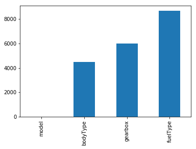


```python
# 可视化看下缺省值
msno.matrix(Train_data.sample(250))
```


    <matplotlib.axes._subplots.AxesSubplot at 0x1a2a19ee48>


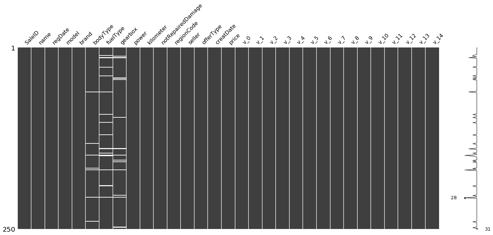


```python
msno.bar(Train_data.sample(1000))
```


    <matplotlib.axes._subplots.AxesSubplot at 0x1a2af43c50>


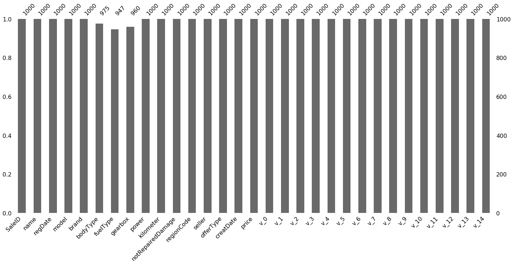


```python
Train_data['notRepairedDamage'].value_counts()
```


    0.0    111361
    -       24324
    1.0     14315
    Name: notRepairedDamage, dtype: int64


```python
Train_data['notRepairedDamage'].replace('-', np.nan, inplace=True)
```


```python
Train_data['notRepairedDamage'].value_counts()
```


    0.0    111361
    1.0     14315
    Name: notRepairedDamage, dtype: int64


```python
Test_data['notRepairedDamage'].replace('-', np.nan, inplace=True)
```


```python
Train_data["seller"].value_counts()
```


    0    149999
    1         1
    Name: seller, dtype: int64


```python
Train_data["offerType"].value_counts()
```


    0    150000
    Name: offerType, dtype: int64


```python
del Train_data["seller"]
del Train_data["offerType"]
del Test_data["seller"]
del Test_data["offerType"]
```


```python
## 1) 总体分布概况（无界约翰逊分布等）
import scipy.stats as st
y = Train_data['price']
plt.figure(1); plt.title('Johnson SU')
sns.distplot(y, kde=False, fit=st.johnsonsu)
plt.figure(2); plt.title('Normbal')
sns.distplot(y, kde=False, fit=st.norm)
plt.figure(3); plt.title('Log Normal')
sns.distplot(y, kde=False, fit=st.lognorm)
```


    <matplotlib.axes._subplots.AxesSubplot at 0x110e65048>


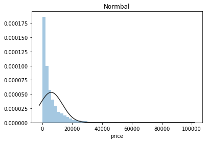


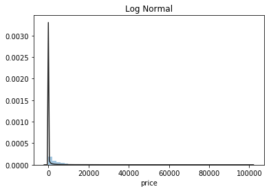


```python
## 2) 查看skewness and kurtosis
sns.distplot(Train_data['price']);
print("Skewness: %f" % Train_data['price'].skew())
print("Kurtosis: %f" % Train_data['price'].kurt())
```

    Skewness: 3.346487
    Kurtosis: 18.995183


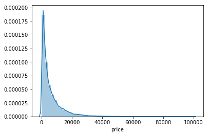


```python
Train_data.skew(), Train_data.kurt()
```


    (SaleID               6.017846e-17
     name                 5.576058e-01
     regDate              2.849508e-02
     model                1.484388e+00
     brand                1.150760e+00
     bodyType             9.915299e-01
     fuelType             1.595486e+00
     gearbox              1.317514e+00
     power                6.586318e+01
     kilometer           -1.525921e+00
     notRepairedDamage    2.430640e+00
     regionCode           6.888812e-01
     creatDate           -7.901331e+01
     price                3.346487e+00
     v_0                 -1.316712e+00
     v_1                  3.594543e-01
     v_2                  4.842556e+00
     v_3                  1.062920e-01
     v_4                  3.679890e-01
     v_5                 -4.737094e+00
     v_6                  3.680730e-01
     v_7                  5.130233e+00
     v_8                  2.046133e-01
     v_9                  4.195007e-01
     v_10                 2.522046e-02
     v_11                 3.029146e+00
     v_12                 3.653576e-01
     v_13                 2.679152e-01
     v_14                -1.186355e+00
     dtype: float64, SaleID                 -1.200000
     name                   -1.039945
     regDate                -0.697308
     model                   1.740483
     brand                   1.076201
     bodyType                0.206937
     fuelType                5.880049
     gearbox                -0.264161
     power                5733.451054
     kilometer               1.141934
     notRepairedDamage       3.908072
     regionCode             -0.340832
     creatDate            6881.080328
     price                  18.995183
     v_0                     3.993841
     v_1                    -1.753017
     v_2                    23.860591
     v_3                    -0.418006
     v_4                    -0.197295
     v_5                    22.934081
     v_6                    -1.742567
     v_7                    25.845489
     v_8                    -0.636225
     v_9                    -0.321491
     v_10                   -0.577935
     v_11                   12.568731
     v_12                    0.268937
     v_13                   -0.438274
     v_14                    2.393526
     dtype: float64)


```python
sns.distplot(Train_data.skew(),color='blue',axlabel ='Skewness')
```


    <matplotlib.axes._subplots.AxesSubplot at 0x1a29f01c50>


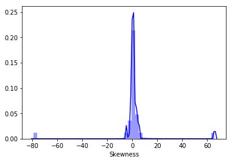


```python
## 3) 查看预测值的具体频数
plt.hist(Train_data['price'], orientation = 'vertical',histtype = 'bar', color ='red')
plt.show()

```


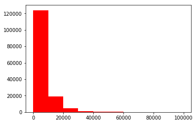


```python
# log变换 z之后的分布较均匀，可以进行log变换进行预测，这也是预测问题常用的trick
plt.hist(np.log(Train_data['price']), orientation = 'vertical',histtype = 'bar', color ='red') 
plt.show()
```


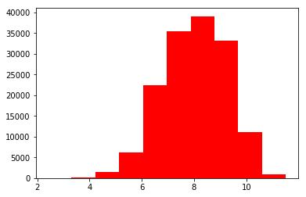


```python
# 分离label即预测值
Y_train = Train_data['price']
```


```python
numeric_features = ['power', 'kilometer', 'v_0', 'v_1', 'v_2', 'v_3', 'v_4', 'v_5', 'v_6', 'v_7', 'v_8', 'v_9', 'v_10', 'v_11', 'v_12', 'v_13','v_14' ]

categorical_features = ['name', 'model', 'brand', 'bodyType', 'fuelType', 'gearbox', 'notRepairedDamage', 'regionCode',]
```


```python
# 特征nunique分布
for cat_fea in categorical_features:
    print(cat_fea + "的特征分布如下：")
    print("{}特征有个{}不同的值".format(cat_fea, Train_data[cat_fea].nunique()))
    print(Train_data[cat_fea].value_counts())
```

    name的特征分布如下：
    name特征有个99662不同的值
    708       282
    387       282
    55        280
    1541      263
    203       233
             ... 
    5074        1
    7123        1
    11221       1
    13270       1
    174485      1
    Name: name, Length: 99662, dtype: int64
    model的特征分布如下：
    model特征有个248不同的值
    0.0      11762
    19.0      9573
    4.0       8445
    1.0       6038
    29.0      5186
             ...  
    245.0        2
    209.0        2
    240.0        2
    242.0        2
    247.0        1
    Name: model, Length: 248, dtype: int64
    brand的特征分布如下：
    brand特征有个40不同的值
    0     31480
    4     16737
    14    16089
    10    14249
    1     13794
    6     10217
    9      7306
    5      4665
    13     3817
    11     2945
    3      2461
    7      2361
    16     2223
    8      2077
    25     2064
    27     2053
    21     1547
    15     1458
    19     1388
    20     1236
    12     1109
    22     1085
    26      966
    30      940
    17      913
    24      772
    28      649
    32      592
    29      406
    37      333
    2       321
    31      318
    18      316
    36      228
    34      227
    33      218
    23      186
    35      180
    38       65
    39        9
    Name: brand, dtype: int64
    bodyType的特征分布如下：
    bodyType特征有个8不同的值
    0.0    41420
    1.0    35272
    2.0    30324
    3.0    13491
    4.0     9609
    5.0     7607
    6.0     6482
    7.0     1289
    Name: bodyType, dtype: int64
    fuelType的特征分布如下：
    fuelType特征有个7不同的值
    0.0    91656
    1.0    46991
    2.0     2212
    3.0      262
    4.0      118
    5.0       45
    6.0       36
    Name: fuelType, dtype: int64
    gearbox的特征分布如下：
    gearbox特征有个2不同的值
    0.0    111623
    1.0     32396
    Name: gearbox, dtype: int64
    notRepairedDamage的特征分布如下：
    notRepairedDamage特征有个2不同的值
    0.0    111361
    1.0     14315
    Name: notRepairedDamage, dtype: int64
    regionCode的特征分布如下：
    regionCode特征有个7905不同的值
    419     369
    764     258
    125     137
    176     136
    462     134
           ... 
    6414      1
    7063      1
    4239      1
    5931      1
    7267      1
    Name: regionCode, Length: 7905, dtype: int64


```python
numeric_features.append('price')
```


```python
numeric_features
```


    ['power',
     'kilometer',
     'v_0',
     'v_1',
     'v_2',
     'v_3',
     'v_4',
     'v_5',
     'v_6',
     'v_7',
     'v_8',
     'v_9',
     'v_10',
     'v_11',
     'v_12',
     'v_13',
     'v_14',
     'price']


```python
Train_data.head()
```


<div>
<style scoped>
    .dataframe tbody tr th:only-of-type {
        vertical-align: middle;
    }

    .dataframe tbody tr th {
        vertical-align: top;
    }

    .dataframe thead th {
        text-align: right;
    }
</style>
<table border="1" class="dataframe">
  <thead>
    <tr style="text-align: right;">
      <th></th>
      <th>SaleID</th>
      <th>name</th>
      <th>regDate</th>
      <th>model</th>
      <th>brand</th>
      <th>bodyType</th>
      <th>fuelType</th>
      <th>gearbox</th>
      <th>power</th>
      <th>kilometer</th>
      <th>...</th>
      <th>v_5</th>
      <th>v_6</th>
      <th>v_7</th>
      <th>v_8</th>
      <th>v_9</th>
      <th>v_10</th>
      <th>v_11</th>
      <th>v_12</th>
      <th>v_13</th>
      <th>v_14</th>
    </tr>
  </thead>
  <tbody>
    <tr>
      <th>0</th>
      <td>0</td>
      <td>736</td>
      <td>20040402</td>
      <td>30.0</td>
      <td>6</td>
      <td>1.0</td>
      <td>0.0</td>
      <td>0.0</td>
      <td>60</td>
      <td>12.5</td>
      <td>...</td>
      <td>0.235676</td>
      <td>0.101988</td>
      <td>0.129549</td>
      <td>0.022816</td>
      <td>0.097462</td>
      <td>-2.881803</td>
      <td>2.804097</td>
      <td>-2.420821</td>
      <td>0.795292</td>
      <td>0.914762</td>
    </tr>
    <tr>
      <th>1</th>
      <td>1</td>
      <td>2262</td>
      <td>20030301</td>
      <td>40.0</td>
      <td>1</td>
      <td>2.0</td>
      <td>0.0</td>
      <td>0.0</td>
      <td>0</td>
      <td>15.0</td>
      <td>...</td>
      <td>0.264777</td>
      <td>0.121004</td>
      <td>0.135731</td>
      <td>0.026597</td>
      <td>0.020582</td>
      <td>-4.900482</td>
      <td>2.096338</td>
      <td>-1.030483</td>
      <td>-1.722674</td>
      <td>0.245522</td>
    </tr>
    <tr>
      <th>2</th>
      <td>2</td>
      <td>14874</td>
      <td>20040403</td>
      <td>115.0</td>
      <td>15</td>
      <td>1.0</td>
      <td>0.0</td>
      <td>0.0</td>
      <td>163</td>
      <td>12.5</td>
      <td>...</td>
      <td>0.251410</td>
      <td>0.114912</td>
      <td>0.165147</td>
      <td>0.062173</td>
      <td>0.027075</td>
      <td>-4.846749</td>
      <td>1.803559</td>
      <td>1.565330</td>
      <td>-0.832687</td>
      <td>-0.229963</td>
    </tr>
    <tr>
      <th>3</th>
      <td>3</td>
      <td>71865</td>
      <td>19960908</td>
      <td>109.0</td>
      <td>10</td>
      <td>0.0</td>
      <td>0.0</td>
      <td>1.0</td>
      <td>193</td>
      <td>15.0</td>
      <td>...</td>
      <td>0.274293</td>
      <td>0.110300</td>
      <td>0.121964</td>
      <td>0.033395</td>
      <td>0.000000</td>
      <td>-4.509599</td>
      <td>1.285940</td>
      <td>-0.501868</td>
      <td>-2.438353</td>
      <td>-0.478699</td>
    </tr>
    <tr>
      <th>4</th>
      <td>4</td>
      <td>111080</td>
      <td>20120103</td>
      <td>110.0</td>
      <td>5</td>
      <td>1.0</td>
      <td>0.0</td>
      <td>0.0</td>
      <td>68</td>
      <td>5.0</td>
      <td>...</td>
      <td>0.228036</td>
      <td>0.073205</td>
      <td>0.091880</td>
      <td>0.078819</td>
      <td>0.121534</td>
      <td>-1.896240</td>
      <td>0.910783</td>
      <td>0.931110</td>
      <td>2.834518</td>
      <td>1.923482</td>
    </tr>
  </tbody>
</table>
<p>5 rows × 29 columns</p>
</div>


```python
## 1) 相关性分析
price_numeric = Train_data[numeric_features]
correlation = price_numeric.corr()
print(correlation['price'].sort_values(ascending = False),'\n')
```

    price        1.000000
    v_12         0.692823
    v_8          0.685798
    v_0          0.628397
    power        0.219834
    v_5          0.164317
    v_2          0.085322
    v_6          0.068970
    v_1          0.060914
    v_14         0.035911
    v_13        -0.013993
    v_7         -0.053024
    v_4         -0.147085
    v_9         -0.206205
    v_10        -0.246175
    v_11        -0.275320
    kilometer   -0.440519
    v_3         -0.730946
    Name: price, dtype: float64 
    


```python
f , ax = plt.subplots(figsize = (7, 7))

plt.title('Correlation of Numeric Features with Price',y=1,size=16)

sns.heatmap(correlation,square = True,  vmax=0.8)
```


    <matplotlib.axes._subplots.AxesSubplot at 0x1a2b66ba90>


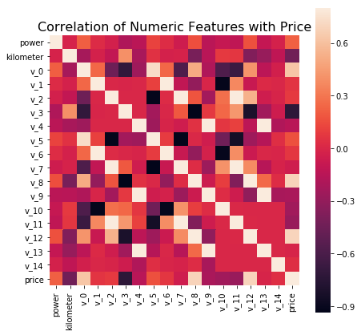


```python
del price_numeric['price']
## 2) 查看几个特征得 偏度和峰值
for col in numeric_features:
    print('{:15}'.format(col), 
          'Skewness: {:05.2f}'.format(Train_data[col].skew()) , 
          '   ' ,
          'Kurtosis: {:06.2f}'.format(Train_data[col].kurt())  
         )
```

    power           Skewness: 65.86     Kurtosis: 5733.45
    kilometer       Skewness: -1.53     Kurtosis: 001.14
    v_0             Skewness: -1.32     Kurtosis: 003.99
    v_1             Skewness: 00.36     Kurtosis: -01.75
    v_2             Skewness: 04.84     Kurtosis: 023.86
    v_3             Skewness: 00.11     Kurtosis: -00.42
    v_4             Skewness: 00.37     Kurtosis: -00.20
    v_5             Skewness: -4.74     Kurtosis: 022.93
    v_6             Skewness: 00.37     Kurtosis: -01.74
    v_7             Skewness: 05.13     Kurtosis: 025.85
    v_8             Skewness: 00.20     Kurtosis: -00.64
    v_9             Skewness: 00.42     Kurtosis: -00.32
    v_10            Skewness: 00.03     Kurtosis: -00.58
    v_11            Skewness: 03.03     Kurtosis: 012.57
    v_12            Skewness: 00.37     Kurtosis: 000.27
    v_13            Skewness: 00.27     Kurtosis: -00.44
    v_14            Skewness: -1.19     Kurtosis: 002.39
    price           Skewness: 03.35     Kurtosis: 019.00


```python
## 3) 每个数字特征得分布可视化
f = pd.melt(Train_data, value_vars=numeric_features)
g = sns.FacetGrid(f, col="variable",  col_wrap=2, sharex=False, sharey=False)
g = g.map(sns.distplot, "value")
```


```python
## 4) 数字特征相互之间的关系可视化
sns.set()
columns = ['price', 'v_12', 'v_8' , 'v_0', 'power', 'v_5',  'v_2', 'v_6', 'v_1', 'v_14']
sns.pairplot(Train_data[columns],size = 2 ,kind ='scatter',diag_kind='kde')
plt.show()
```


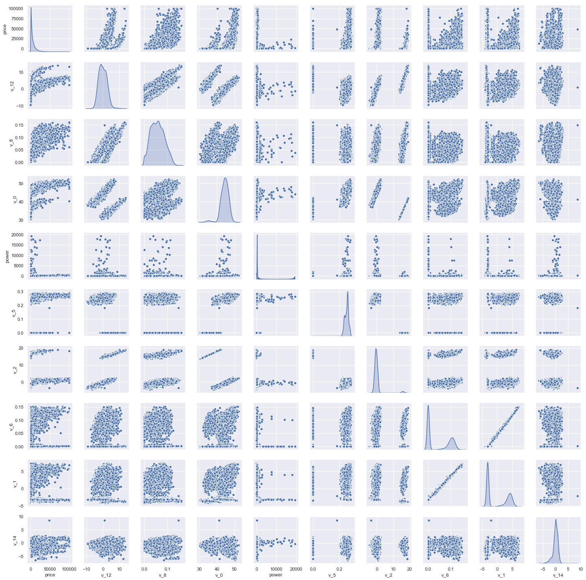


```python
Train_data.columns
```


    Index(['SaleID', 'name', 'regDate', 'model', 'brand', 'bodyType', 'fuelType',
           'gearbox', 'power', 'kilometer', 'notRepairedDamage', 'regionCode',
           'creatDate', 'price', 'v_0', 'v_1', 'v_2', 'v_3', 'v_4', 'v_5', 'v_6',
           'v_7', 'v_8', 'v_9', 'v_10', 'v_11', 'v_12', 'v_13', 'v_14'],
          dtype='object')


```python
## 5) 多变量互相回归关系可视化
fig, ((ax1, ax2), (ax3, ax4), (ax5, ax6), (ax7, ax8), (ax9, ax10)) = plt.subplots(nrows=5, ncols=2, figsize=(24, 20))
# ['v_12', 'v_8' , 'v_0', 'power', 'v_5',  'v_2', 'v_6', 'v_1', 'v_14']
v_12_scatter_plot = pd.concat([Y_train,Train_data['v_12']],axis = 1)
sns.regplot(x='v_12',y = 'price', data = v_12_scatter_plot,scatter= True, fit_reg=True, ax=ax1)

v_8_scatter_plot = pd.concat([Y_train,Train_data['v_8']],axis = 1)
sns.regplot(x='v_8',y = 'price',data = v_8_scatter_plot,scatter= True, fit_reg=True, ax=ax2)

v_0_scatter_plot = pd.concat([Y_train,Train_data['v_0']],axis = 1)
sns.regplot(x='v_0',y = 'price',data = v_0_scatter_plot,scatter= True, fit_reg=True, ax=ax3)

power_scatter_plot = pd.concat([Y_train,Train_data['power']],axis = 1)
sns.regplot(x='power',y = 'price',data = power_scatter_plot,scatter= True, fit_reg=True, ax=ax4)

v_5_scatter_plot = pd.concat([Y_train,Train_data['v_5']],axis = 1)
sns.regplot(x='v_5',y = 'price',data = v_5_scatter_plot,scatter= True, fit_reg=True, ax=ax5)

v_2_scatter_plot = pd.concat([Y_train,Train_data['v_2']],axis = 1)
sns.regplot(x='v_2',y = 'price',data = v_2_scatter_plot,scatter= True, fit_reg=True, ax=ax6)

v_6_scatter_plot = pd.concat([Y_train,Train_data['v_6']],axis = 1)
sns.regplot(x='v_6',y = 'price',data = v_6_scatter_plot,scatter= True, fit_reg=True, ax=ax7)

v_1_scatter_plot = pd.concat([Y_train,Train_data['v_1']],axis = 1)
sns.regplot(x='v_1',y = 'price',data = v_1_scatter_plot,scatter= True, fit_reg=True, ax=ax8)

v_14_scatter_plot = pd.concat([Y_train,Train_data['v_14']],axis = 1)
sns.regplot(x='v_14',y = 'price',data = v_14_scatter_plot,scatter= True, fit_reg=True, ax=ax9)

v_13_scatter_plot = pd.concat([Y_train,Train_data['v_13']],axis = 1)
sns.regplot(x='v_13',y = 'price',data = v_13_scatter_plot,scatter= True, fit_reg=True, ax=ax10)
```


    <matplotlib.axes._subplots.AxesSubplot at 0x1a4538dac8>


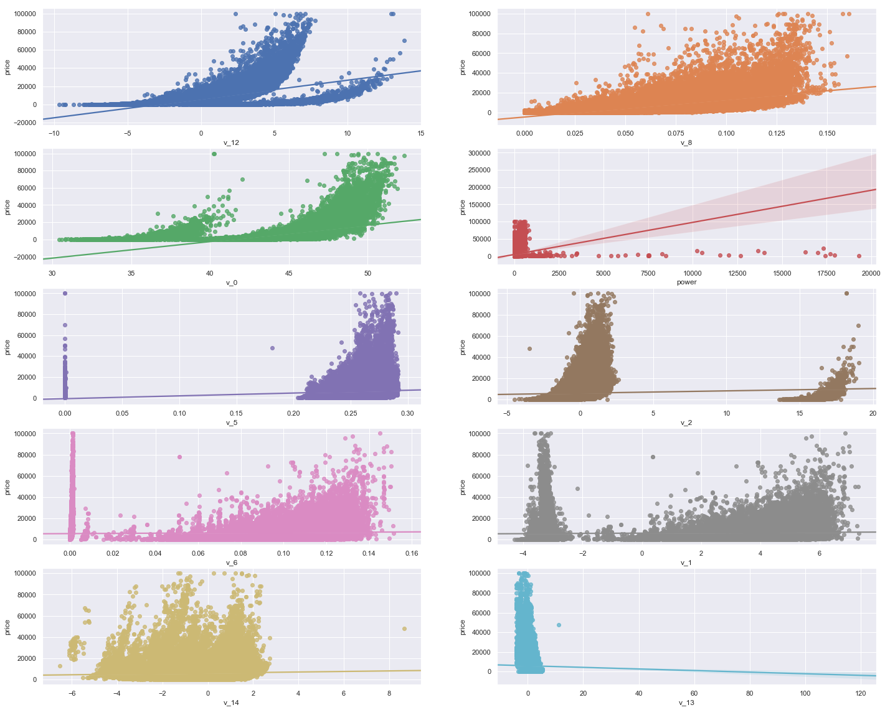


```python
## 1) unique分布
for fea in categorical_features:
    print(Train_data[fea].nunique())
```

    99662
    248
    40
    8
    7
    2
    2
    7905


```python
categorical_features
```


    ['name',
     'model',
     'brand',
     'bodyType',
     'fuelType',
     'gearbox',
     'notRepairedDamage',
     'regionCode']


```python
## 2) 类别特征箱形图可视化

# 因为 name和 regionCode的类别太稀疏了，这里我们把不稀疏的几类画一下
categorical_features = ['model',
 'brand',
 'bodyType',
 'fuelType',
 'gearbox',
 'notRepairedDamage']
for c in categorical_features:
    Train_data[c] = Train_data[c].astype('category')
    if Train_data[c].isnull().any():
        Train_data[c] = Train_data[c].cat.add_categories(['MISSING'])
        Train_data[c] = Train_data[c].fillna('MISSING')

def boxplot(x, y, **kwargs):
    sns.boxplot(x=x, y=y)
    x=plt.xticks(rotation=90)

f = pd.melt(Train_data, id_vars=['price'], value_vars=categorical_features)
g = sns.FacetGrid(f, col="variable",  col_wrap=2, sharex=False, sharey=False, size=5)
g = g.map(boxplot, "value", "price")
```


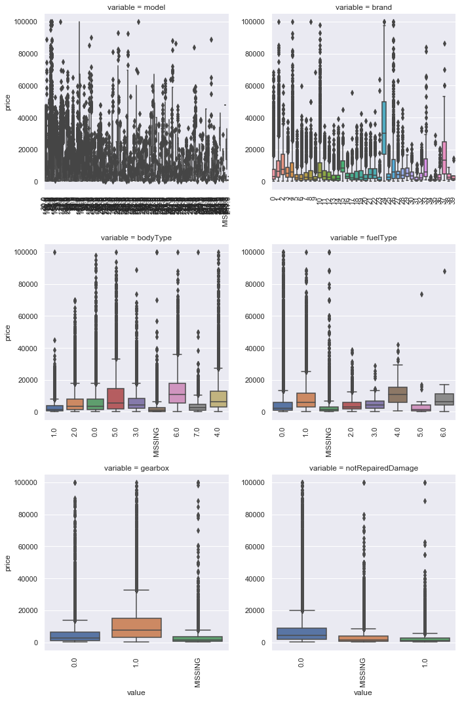


```python
## 3) 类别特征的小提琴图可视化
catg_list = categorical_features
target = 'price'
for catg in catg_list :
    sns.violinplot(x=catg, y=target, data=Train_data)
    plt.show()

```


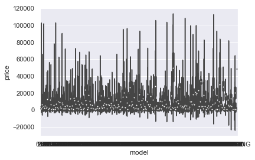


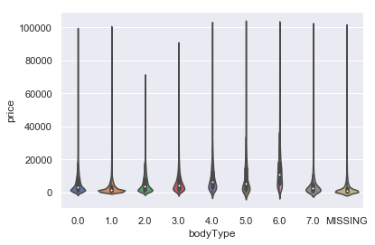


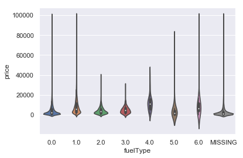


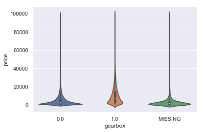


```python
## 4) 类别特征的柱形图可视化
def bar_plot(x, y, **kwargs):
    sns.barplot(x=x, y=y)
    x=plt.xticks(rotation=90)

f = pd.melt(Train_data, id_vars=['price'], value_vars=categorical_features)
g = sns.FacetGrid(f, col="variable",  col_wrap=2, sharex=False, sharey=False, size=5)
g = g.map(bar_plot, "value", "price")
```


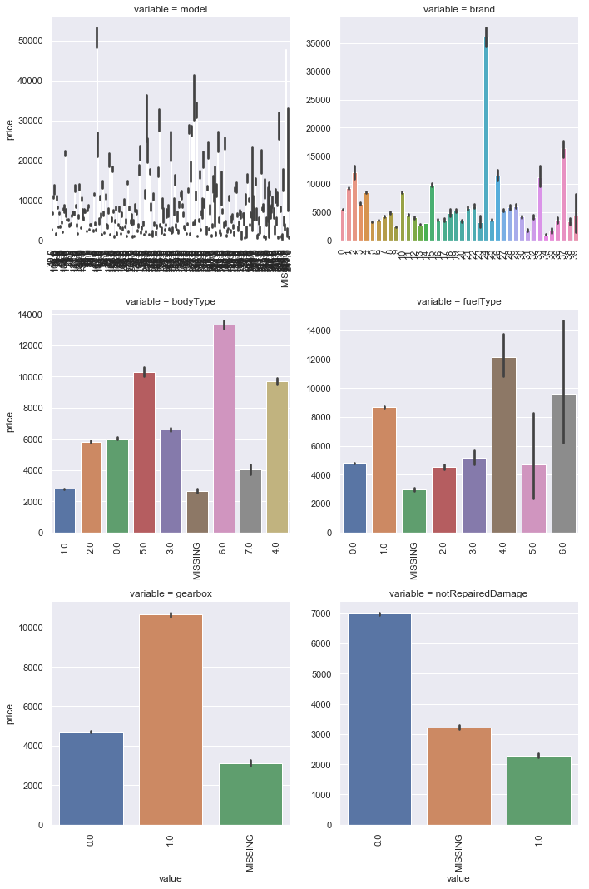


```python
##  5) 类别特征的每个类别频数可视化(count_plot)
def count_plot(x,  **kwargs):
    sns.countplot(x=x)
    x=plt.xticks(rotation=90)

f = pd.melt(Train_data,  value_vars=categorical_features)
g = sns.FacetGrid(f, col="variable",  col_wrap=2, sharex=False, sharey=False, size=5)
g = g.map(count_plot, "value")
```


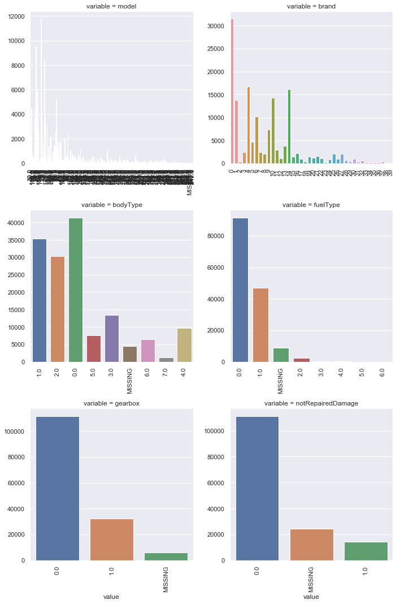


```python
import pandas_profiling
pfr = pandas_profiling.ProfileReport(Train_data)
pfr.to_file("./example.html")
```
