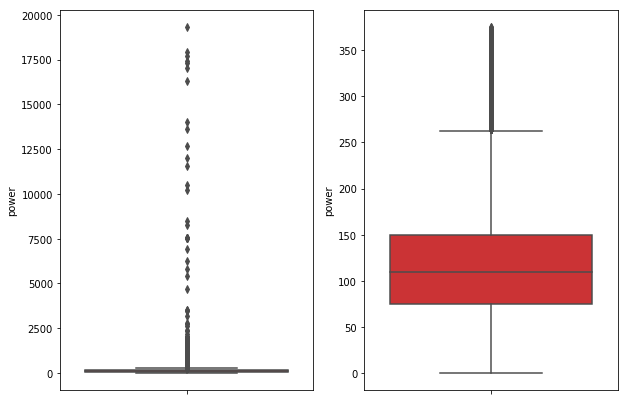
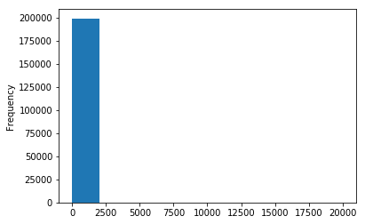
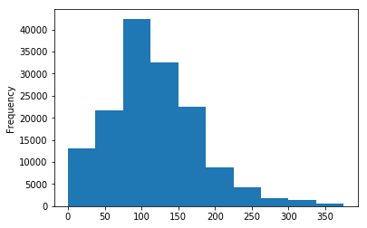
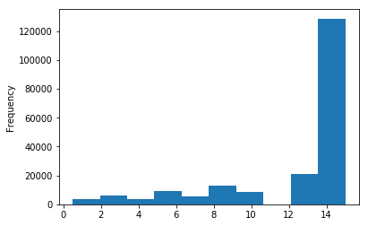
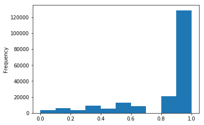
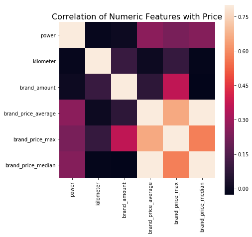

# Task3学习笔记

## 特征工程

### 存在问题
mlxtend的安装遇到问题，后半部分实验需要仔细研究

### 导入数据


```python
import pandas as pd
import numpy as np
import matplotlib
import matplotlib.pyplot as plt
import seaborn as sns
from operator import itemgetter

%matplotlib inline

```


```python
path = './数据挖掘实践（二手车价格预测）/data/'
## 1) 载入训练集和测试集；
train = pd.read_csv(path+'used_car_train_20200313.csv',sep=' ')
test = pd.read_csv(path+'used_car_testA_20200313.csv',sep=' ')
print(train.shape)
print(test.shape)
```

    (150000, 31)
    (50000, 30)


### 删除异常值


```python
def outliers_proc(data, col_name, scale=3):
    """
    用于清洗异常值，默认用 box_plot（scale=3）进行清洗
    :param data: 接收 pandas 数据格式
    :param col_name: pandas 列名
    :param scale: 尺度
    :return:
    """

    def box_plot_outliers(data_ser, box_scale):
        """
        利用箱线图去除异常值
        :param data_ser: 接收 pandas.Series 数据格式
        :param box_scale: 箱线图尺度，
        :return:
        """
        iqr = box_scale * (data_ser.quantile(0.75) - data_ser.quantile(0.25))
        val_low = data_ser.quantile(0.25) - iqr
        val_up = data_ser.quantile(0.75) + iqr
        rule_low = (data_ser < val_low)
        rule_up = (data_ser > val_up)
        return (rule_low, rule_up), (val_low, val_up)

    data_n = data.copy()
    data_series = data_n[col_name]
    rule, value = box_plot_outliers(data_series, box_scale=scale)
    index = np.arange(data_series.shape[0])[rule[0] | rule[1]]
    print("Delete number is: {}".format(len(index)))
    data_n = data_n.drop(index)
    data_n.reset_index(drop=True, inplace=True)
    print("Now column number is: {}".format(data_n.shape[0]))
    index_low = np.arange(data_series.shape[0])[rule[0]]
    outliers = data_series.iloc[index_low]
    print("Description of data less than the lower bound is:")
    print(pd.Series(outliers).describe())
    index_up = np.arange(data_series.shape[0])[rule[1]]
    outliers = data_series.iloc[index_up]
    print("Description of data larger than the upper bound is:")
    print(pd.Series(outliers).describe())
    
    fig, ax = plt.subplots(1, 2, figsize=(10, 7))
    sns.boxplot(y=data[col_name], data=data, palette="Set1", ax=ax[0])
    sns.boxplot(y=data_n[col_name], data=data_n, palette="Set1", ax=ax[1])
    return data_n
```


```python
train = outliers_proc(train, 'power', scale=3)
```

    Delete number is: 963
    Now column number is: 149037
    Description of data less than the lower bound is:
    count    0.0
    mean     NaN
    std      NaN
    min      NaN
    25%      NaN
    50%      NaN
    75%      NaN
    max      NaN
    Name: power, dtype: float64
    Description of data larger than the upper bound is:
    count      963.000000
    mean       846.836968
    std       1929.418081
    min        376.000000
    25%        400.000000
    50%        436.000000
    75%        514.000000
    max      19312.000000
    Name: power, dtype: float64





### 特征构造


```python
# 训练集和测试集放在一起，方便构造特征
train['train']=1
test['train']=0
data = pd.concat([train, test], ignore_index=True, sort=False)
```


```python
# 使用时间：data['creatDate'] - data['regDate']，反应汽车使用时间，一般来说价格与使用时间成反比
# 不过要注意，数据里有时间出错的格式，所以我们需要 errors='coerce'
data['used_time'] = (pd.to_datetime(data['creatDate'], format='%Y%m%d', errors='coerce') - 
                            pd.to_datetime(data['regDate'], format='%Y%m%d', errors='coerce')).dt.days
```


```python
# 看一下空数据，有 15k 个样本的时间是有问题的，我们可以选择删除，也可以选择放着。
# 但是这里不建议删除，因为删除缺失数据占总样本量过大，7.5%
# 我们可以先放着，因为如果我们 XGBoost 之类的决策树，其本身就能处理缺失值，所以可以不用管；
data['used_time'].isnull().sum()
```


    15072


```python
# 从邮编中提取城市信息，因为是德国的数据，所以参考德国的邮编，相当于加入了先验知识
data['city'] = data['regionCode'].apply(lambda x : str(x)[:-3])
```


```python
# 计算某品牌的销售统计量，同学们还可以计算其他特征的统计量
# 这里要以 train 的数据计算统计量
train_gb = train.groupby("brand")
all_info = {}
for kind, kind_data in train_gb:
    info = {}
    kind_data = kind_data[kind_data['price'] > 0]
    info['brand_amount'] = len(kind_data)
    info['brand_price_max'] = kind_data.price.max()
    info['brand_price_median'] = kind_data.price.median()
    info['brand_price_min'] = kind_data.price.min()
    info['brand_price_sum'] = kind_data.price.sum()
    info['brand_price_std'] = kind_data.price.std()
    info['brand_price_average'] = round(kind_data.price.sum() / (len(kind_data) + 1), 2)
    all_info[kind] = info
brand_fe = pd.DataFrame(all_info).T.reset_index().rename(columns={"index": "brand"})
data = data.merge(brand_fe, how='left', on='brand')
```


```python
# 数据分桶 以 power 为例
# 这时候我们的缺失值也进桶了，
# 为什么要做数据分桶呢，原因有很多，= =
# 1. 离散后稀疏向量内积乘法运算速度更快，计算结果也方便存储，容易扩展；
# 2. 离散后的特征对异常值更具鲁棒性，如 age>30 为 1 否则为 0，对于年龄为 200 的也不会对模型造成很大的干扰；
# 3. LR 属于广义线性模型，表达能力有限，经过离散化后，每个变量有单独的权重，这相当于引入了非线性，能够提升模型的表达能力，加大拟合；
# 4. 离散后特征可以进行特征交叉，提升表达能力，由 M+N 个变量编程 M*N 个变量，进一步引入非线形，提升了表达能力；
# 5. 特征离散后模型更稳定，如用户年龄区间，不会因为用户年龄长了一岁就变化

# 当然还有很多原因，LightGBM 在改进 XGBoost 时就增加了数据分桶，增强了模型的泛化性

bin = [i*10 for i in range(31)]
data['power_bin'] = pd.cut(data['power'], bin, labels=False)
data[['power_bin', 'power']].head()
```


<div>
<style scoped>
    .dataframe tbody tr th:only-of-type {
        vertical-align: middle;
    }

    .dataframe tbody tr th {
        vertical-align: top;
    }

    .dataframe thead th {
        text-align: right;
    }
</style>
<table border="1" class="dataframe">
  <thead>
    <tr style="text-align: right;">
      <th></th>
      <th>power_bin</th>
      <th>power</th>
    </tr>
  </thead>
  <tbody>
    <tr>
      <th>0</th>
      <td>5.0</td>
      <td>60</td>
    </tr>
    <tr>
      <th>1</th>
      <td>NaN</td>
      <td>0</td>
    </tr>
    <tr>
      <th>2</th>
      <td>16.0</td>
      <td>163</td>
    </tr>
    <tr>
      <th>3</th>
      <td>19.0</td>
      <td>193</td>
    </tr>
    <tr>
      <th>4</th>
      <td>6.0</td>
      <td>68</td>
    </tr>
  </tbody>
</table>
</div>


```python
data = data.drop(['creatDate', 'regDate', 'regionCode'], axis=1)
```


```python
print(data.shape)
data.columns
```

    (199037, 39)


    Index(['SaleID', 'name', 'model', 'brand', 'bodyType', 'fuelType', 'gearbox',
           'power', 'kilometer', 'notRepairedDamage', 'seller', 'offerType',
           'price', 'v_0', 'v_1', 'v_2', 'v_3', 'v_4', 'v_5', 'v_6', 'v_7', 'v_8',
           'v_9', 'v_10', 'v_11', 'v_12', 'v_13', 'v_14', 'train', 'used_time',
           'city', 'brand_amount', 'brand_price_max', 'brand_price_median',
           'brand_price_min', 'brand_price_sum', 'brand_price_std',
           'brand_price_average', 'power_bin'],
          dtype='object')


```python
data['power'].plot.hist()
```


    <matplotlib.axes._subplots.AxesSubplot at 0x1a2fc52c50>





```python
train['power'].plot.hist()
```


    <matplotlib.axes._subplots.AxesSubplot at 0x1a27477358>





```python
data['kilometer'].plot.hist()
```


    <matplotlib.axes._subplots.AxesSubplot at 0x1a26dbf2b0>





```python
# 所以我们可以直接做归一化
data['kilometer'] = ((data['kilometer'] - np.min(data['kilometer'])) / 
                        (np.max(data['kilometer']) - np.min(data['kilometer'])))
data['kilometer'].plot.hist()
```


    <matplotlib.axes._subplots.AxesSubplot at 0x1a28fb80f0>





```python
# 除此之外 还有我们刚刚构造的统计量特征：
# 'brand_amount', 'brand_price_average', 'brand_price_max',
# 'brand_price_median', 'brand_price_min', 'brand_price_std',
# 'brand_price_sum'
# 这里不再一一举例分析了，直接做变换，
def max_min(x):
    return (x - np.min(x)) / (np.max(x) - np.min(x))

data['brand_amount'] = ((data['brand_amount'] - np.min(data['brand_amount'])) / 
                        (np.max(data['brand_amount']) - np.min(data['brand_amount'])))
data['brand_price_average'] = ((data['brand_price_average'] - np.min(data['brand_price_average'])) / 
                               (np.max(data['brand_price_average']) - np.min(data['brand_price_average'])))
data['brand_price_max'] = ((data['brand_price_max'] - np.min(data['brand_price_max'])) / 
                           (np.max(data['brand_price_max']) - np.min(data['brand_price_max'])))
data['brand_price_median'] = ((data['brand_price_median'] - np.min(data['brand_price_median'])) /
                              (np.max(data['brand_price_median']) - np.min(data['brand_price_median'])))
data['brand_price_min'] = ((data['brand_price_min'] - np.min(data['brand_price_min'])) / 
                           (np.max(data['brand_price_min']) - np.min(data['brand_price_min'])))
data['brand_price_std'] = ((data['brand_price_std'] - np.min(data['brand_price_std'])) / 
                           (np.max(data['brand_price_std']) - np.min(data['brand_price_std'])))
data['brand_price_sum'] = ((data['brand_price_sum'] - np.min(data['brand_price_sum'])) / 
                           (np.max(data['brand_price_sum']) - np.min(data['brand_price_sum'])))
```


```python
# 对类别特征进行 OneEncoder
data = pd.get_dummies(data, columns=['model', 'brand', 'bodyType', 'fuelType',
                                     'gearbox', 'notRepairedDamage', 'power_bin'])
```


```python
print(data.shape)
data.columns
```

    (199037, 370)


    Index(['SaleID', 'name', 'power', 'kilometer', 'seller', 'offerType', 'price',
           'v_0', 'v_1', 'v_2',
           ...
           'power_bin_20.0', 'power_bin_21.0', 'power_bin_22.0', 'power_bin_23.0',
           'power_bin_24.0', 'power_bin_25.0', 'power_bin_26.0', 'power_bin_27.0',
           'power_bin_28.0', 'power_bin_29.0'],
          dtype='object', length=370)


### 数据筛选


```python
# 相关性分析
print(data['power'].corr(data['price'], method='spearman'))
print(data['kilometer'].corr(data['price'], method='spearman'))
print(data['brand_amount'].corr(data['price'], method='spearman'))
print(data['brand_price_average'].corr(data['price'], method='spearman'))
print(data['brand_price_max'].corr(data['price'], method='spearman'))
print(data['brand_price_median'].corr(data['price'], method='spearman'))
```

    0.5728285196051496
    -0.4082569701616764
    0.058156610025581514
    0.3834909576057687
    0.259066833880992
    0.38691042393409447


```python
# 当然也可以直接看图
data_numeric = data[['power', 'kilometer', 'brand_amount', 'brand_price_average', 
                     'brand_price_max', 'brand_price_median']]
correlation = data_numeric.corr()

f , ax = plt.subplots(figsize = (7, 7))
plt.title('Correlation of Numeric Features with Price',y=1,size=16)
sns.heatmap(correlation,square = True,  vmax=0.8)
```


    <matplotlib.axes._subplots.AxesSubplot at 0x1a2c1ae438>





```python
!pip install mlxtend
```

    Looking in indexes: https://pypi.tuna.tsinghua.edu.cn/simple
    Requirement already satisfied: mlxtend in /Users/LQ/anaconda3/lib/python3.7/site-packages (0.17.2)
    Requirement already satisfied: scikit-learn>=0.20.3 in /Users/LQ/anaconda3/lib/python3.7/site-packages (from mlxtend) (0.22.2.post1)
    Requirement already satisfied: joblib>=0.13.2 in /Users/LQ/anaconda3/lib/python3.7/site-packages (from mlxtend) (0.14.1)
    Requirement already satisfied: pandas>=0.24.2 in /Users/LQ/anaconda3/lib/python3.7/site-packages (from mlxtend) (1.0.1)
    Requirement already satisfied: numpy>=1.16.2 in /Users/LQ/anaconda3/lib/python3.7/site-packages (from mlxtend) (1.17.2)
    Requirement already satisfied: matplotlib>=3.0.0 in /Users/LQ/anaconda3/lib/python3.7/site-packages (from mlxtend) (3.2.1)
    Requirement already satisfied: scipy>=1.2.1 in /Users/LQ/anaconda3/lib/python3.7/site-packages (from mlxtend) (1.4.1)
    Requirement already satisfied: setuptools in /Users/LQ/anaconda3/lib/python3.7/site-packages (from mlxtend) (41.4.0)
    Requirement already satisfied: pytz>=2017.2 in /Users/LQ/anaconda3/lib/python3.7/site-packages (from pandas>=0.24.2->mlxtend) (2018.5)
    Requirement already satisfied: python-dateutil>=2.6.1 in /Users/LQ/anaconda3/lib/python3.7/site-packages (from pandas>=0.24.2->mlxtend) (2.7.3)
    Requirement already satisfied: kiwisolver>=1.0.1 in /Users/LQ/anaconda3/lib/python3.7/site-packages (from matplotlib>=3.0.0->mlxtend) (1.0.1)
    Requirement already satisfied: pyparsing!=2.0.4,!=2.1.2,!=2.1.6,>=2.0.1 in /Users/LQ/anaconda3/lib/python3.7/site-packages (from matplotlib>=3.0.0->mlxtend) (2.2.0)
    Requirement already satisfied: cycler>=0.10 in /Users/LQ/anaconda3/lib/python3.7/site-packages (from matplotlib>=3.0.0->mlxtend) (0.10.0)
    Requirement already satisfied: six>=1.5 in /Users/LQ/anaconda3/lib/python3.7/site-packages (from python-dateutil>=2.6.1->pandas>=0.24.2->mlxtend) (1.11.0)


```python
from mlxtend.feature_selection import SequentialFeatureSelector as SFS
from sklearn.linear_model import LinearRegression
sfs = SFS(LinearRegression(),
           k_features=10,
           forward=True,
           floating=False,
           scoring = 'r2',
           cv = 0)
x = data.drop(['price'], axis=1)
x = x.fillna(0)
y = data['price']
sfs.fit(x, y)
sfs.k_feature_names_ 
```


    ---------------------------------------------------------------------------

    ValueError                                Traceback (most recent call last)

    <ipython-input-30-15fc8b306c63> in <module>()
         10 x = x.fillna(0)
         11 y = data['price']
    ---> 12 sfs.fit(x, y)
         13 sfs.k_feature_names_


    ~/anaconda3/lib/python3.7/site-packages/mlxtend/feature_selection/sequential_feature_selector.py in fit(self, X, y, custom_feature_names, groups, **fit_params)
        436                         y=y,
        437                         groups=groups,
    --> 438                         **fit_params
        439                     )
        440                 else:


    ~/anaconda3/lib/python3.7/site-packages/mlxtend/feature_selection/sequential_feature_selector.py in _inclusion(self, orig_set, subset, X, y, ignore_feature, groups, **fit_params)
        605                              tuple(subset | {feature}),
        606                              groups=groups, **fit_params)
    --> 607                             for feature in remaining
        608                             if feature != ignore_feature)
        609 


    ~/anaconda3/lib/python3.7/site-packages/joblib/parallel.py in __call__(self, iterable)
       1002             # remaining jobs.
       1003             self._iterating = False
    -> 1004             if self.dispatch_one_batch(iterator):
       1005                 self._iterating = self._original_iterator is not None
       1006 


    ~/anaconda3/lib/python3.7/site-packages/joblib/parallel.py in dispatch_one_batch(self, iterator)
        833                 return False
        834             else:
    --> 835                 self._dispatch(tasks)
        836                 return True
        837 


    ~/anaconda3/lib/python3.7/site-packages/joblib/parallel.py in _dispatch(self, batch)
        752         with self._lock:
        753             job_idx = len(self._jobs)
    --> 754             job = self._backend.apply_async(batch, callback=cb)
        755             # A job can complete so quickly than its callback is
        756             # called before we get here, causing self._jobs to


    ~/anaconda3/lib/python3.7/site-packages/joblib/_parallel_backends.py in apply_async(self, func, callback)
        207     def apply_async(self, func, callback=None):
        208         """Schedule a func to be run"""
    --> 209         result = ImmediateResult(func)
        210         if callback:
        211             callback(result)


    ~/anaconda3/lib/python3.7/site-packages/joblib/_parallel_backends.py in __init__(self, batch)
        588         # Don't delay the application, to avoid keeping the input
        589         # arguments in memory
    --> 590         self.results = batch()
        591 
        592     def get(self):


    ~/anaconda3/lib/python3.7/site-packages/joblib/parallel.py in __call__(self)
        254         with parallel_backend(self._backend, n_jobs=self._n_jobs):
        255             return [func(*args, **kwargs)
    --> 256                     for func, args, kwargs in self.items]
        257 
        258     def __len__(self):


    ~/anaconda3/lib/python3.7/site-packages/joblib/parallel.py in <listcomp>(.0)
        254         with parallel_backend(self._backend, n_jobs=self._n_jobs):
        255             return [func(*args, **kwargs)
    --> 256                     for func, args, kwargs in self.items]
        257 
        258     def __len__(self):


    ~/anaconda3/lib/python3.7/site-packages/mlxtend/feature_selection/sequential_feature_selector.py in _calc_score(selector, X, y, indices, groups, **fit_params)
         35                                  fit_params=fit_params)
         36     else:
    ---> 37         selector.est_.fit(X[:, indices], y, **fit_params)
         38         scores = np.array([selector.scorer(selector.est_, X[:, indices], y)])
         39     return indices, scores


    ~/anaconda3/lib/python3.7/site-packages/sklearn/linear_model/_base.py in fit(self, X, y, sample_weight)
        490         n_jobs_ = self.n_jobs
        491         X, y = check_X_y(X, y, accept_sparse=['csr', 'csc', 'coo'],
    --> 492                          y_numeric=True, multi_output=True)
        493 
        494         if sample_weight is not None:


    ~/anaconda3/lib/python3.7/site-packages/sklearn/utils/validation.py in check_X_y(X, y, accept_sparse, accept_large_sparse, dtype, order, copy, force_all_finite, ensure_2d, allow_nd, multi_output, ensure_min_samples, ensure_min_features, y_numeric, warn_on_dtype, estimator)
        756     if multi_output:
        757         y = check_array(y, 'csr', force_all_finite=True, ensure_2d=False,
    --> 758                         dtype=None)
        759     else:
        760         y = column_or_1d(y, warn=True)


    ~/anaconda3/lib/python3.7/site-packages/sklearn/utils/validation.py in check_array(array, accept_sparse, accept_large_sparse, dtype, order, copy, force_all_finite, ensure_2d, allow_nd, ensure_min_samples, ensure_min_features, warn_on_dtype, estimator)
        576         if force_all_finite:
        577             _assert_all_finite(array,
    --> 578                                allow_nan=force_all_finite == 'allow-nan')
        579 
        580     if ensure_min_samples > 0:


    ~/anaconda3/lib/python3.7/site-packages/sklearn/utils/validation.py in _assert_all_finite(X, allow_nan, msg_dtype)
         58                     msg_err.format
         59                     (type_err,
    ---> 60                      msg_dtype if msg_dtype is not None else X.dtype)
         61             )
         62     # for object dtype data, we only check for NaNs (GH-13254)


    ValueError: Input contains NaN, infinity or a value too large for dtype('float64').


```python
from mlxtend.plotting import plot_sequential_feature_selection as plot_sfs
import matplotlib.pyplot as plt
fig1 = plot_sfs(sfs.get_metric_dict(), kind='std_dev')
plt.grid()
plt.show()
```


    ---------------------------------------------------------------------------

    AttributeError                            Traceback (most recent call last)

    <ipython-input-28-a440277b42ef> in <module>()
          1 from mlxtend.plotting import plot_sequential_feature_selection as plot_sfs
          2 import matplotlib.pyplot as plt
    ----> 3 fig1 = plot_sfs(sfs.get_metric_dict(), kind='std_dev')
          4 plt.grid()
          5 plt.show()


    ~/anaconda3/lib/python3.7/site-packages/mlxtend/feature_selection/sequential_feature_selector.py in get_metric_dict(self, confidence_interval)
        723 
        724         """
    --> 725         self._check_fitted()
        726         fdict = deepcopy(self.subsets_)
        727         for k in fdict:


    ~/anaconda3/lib/python3.7/site-packages/mlxtend/feature_selection/sequential_feature_selector.py in _check_fitted(self)
        742     def _check_fitted(self):
        743         if not self.fitted:
    --> 744             raise AttributeError('SequentialFeatureSelector has not been'
        745                                  ' fitted, yet.')


    AttributeError: SequentialFeatureSelector has not been fitted, yet.

